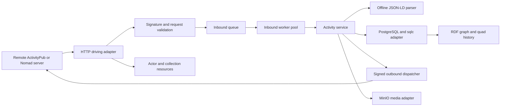

# ActivityPub and Nomad Quad Store Architecture Blueprint

This blueprint describes what the Sprezz federation server does, which responsibilities belong to each subsystem, and how those subsystems collaborate. It is a functional specification rather than an implementation guide. Package names, SQL statements, generated code, and test doubles belong in the source tree and are intentionally omitted here.

## 1. Product Purpose

Sprezz is a multi-tenant ActivityPub and Zot6/Nomad federation server. It accepts signed remote activities, stores their complete historical representations as RDF graphs and quads, exposes ActivityPub discovery and collection resources, and delivers local activities to remote inboxes.

The system must support the following functional outcomes:

- Receive ActivityPub and Zot6-compatible JSON-LD activities through HTTP.
- Reject unauthenticated, stale, malformed, oversized, or blocked requests before persistence.
- Deduplicate an activity globally while recording every local tenant and actor inbox that received it.
- Process accepted activities asynchronously and preserve each accepted representation as an immutable graph version.
- Convert JSON-LD into RDF quads using embedded contexts and deterministic blank-node identifiers.
- Resolve and expose static ActivityPub identities and Nomad identities without coupling either identity model to one hostname.
- Serve actor resources, inboxes, outboxes, followers, and following collections.
- Sign and deliver outbound activities to remote inboxes.
- Store federated media in MinIO when a media workflow requests object storage.

## 2. System Behavior

The request path performs validation and durable queueing only. Parsing, graph persistence, identity enrichment, and downstream delivery happen asynchronously unless a specific operation explicitly requires an immediate read.

## 3. Architectural Boundaries

### 3.1 Driving Adapters

Driving adapters translate external requests into application operations.

The HTTP adapter provides:

- WebFinger discovery for `acct:user@domain` resources.
- ActivityPub inbox intake at the server and actor inbox paths.
- Actor resources and OrderedCollection resources.
- Health reporting for deployment probes.

The adapter does not parse RDF, access PostgreSQL directly, or decide how a graph is stored. It validates the request, extracts the activity identity and object identity, and invokes the relevant port.

### 3.2 Core Domain Services

The activity service coordinates the lifecycle of an accepted activity.

It must:

- Create one immutable graph version for each globally deduplicated activity.
- Parse the payload into quads before committing the graph version.
- Apply deterministic blank-node rewriting before persistence.
- Enrich graph data with Nomad identity relationships when identity information is available.
- Apply audience and actor authorization rules when building timelines or private views.
- Request outbound delivery through a driven port.

The service owns business sequencing and error semantics. It does not own connection pools, HTTP clients, cache implementations, or object-store SDKs.

### 3.3 Driven Ports

Driven ports describe capabilities required by the domain:

- Storage of queues, tenants, identities, graph versions, quads, and collection data.
- High-performance, zero-allocation database stream writing via compact 64-bit integer mappings (`model.QuadID`).
- Conversion of JSON-LD payloads into RDF quads.
- Signed outbound federation.
- Media object storage.

Adapters implement these capabilities without changing domain terminology or leaking driver-specific types into the core.

## 4. Inbound Activity Workflow

### 4.1 Request Acceptance

For every inbox request, the server performs these checks in order:

1. Accept only the configured HTTP method and enforce a maximum body size.
2. Normalize the receiving host and reject a blocked receiving domain.
3. Validate the `Digest` header against the raw request body.
4. Parse the HTTP Signature and require the signed request target, host, date, and digest components.
5. Resolve the remote public key through an HTTPS-only resolver that rejects private, loopback, link-local, and unspecified addresses.
6. Verify the RSA-SHA256 signature and reject stale requests outside the configured freshness window.
7. Parse the JSON activity and derive its activity and object identifiers.
8. Extract the sender actor domain and reject it when it is blocklisted.
9. Enqueue the activity and record the receiving tenant transactionally.
10. Record actor-specific inbox delivery when the request targets an actor inbox.

Invalid requests must not create queue, tenant-delivery, graph, or inbox-delivery records.

### 4.2 Queue Processing

Inbound queue records have four states:

- `pending`: accepted and waiting for a worker.
- `processing`: claimed by a worker.
- `completed`: graph persistence succeeded.
- `failed`: processing failed and the record may be retried according to policy.

Workers claim records with row locking and skip locked rows so concurrent workers do not process the same queue record. A claim increments the attempt count and changes the state before the worker begins domain processing.

The activity identifier is globally unique. Tenant and actor delivery tables provide local fan-out without duplicating graph parsing work.

## 5. Identity and Tenant Functions

### 5.1 Tenant Routing

The receiving hostname identifies the local tenant. Tenant registration is idempotent and occurs within the same transaction as the first delivery record.

The sender hostname is a separate value derived from the verified actor or key identity. It is used for federation policy and blocklist checks, never as a substitute for the receiving tenant.

Tenant-specific delivery records must prevent duplicate `(activity, tenant)` pairs. Actor inbox records must prevent duplicate `(actor, activity)` pairs.

### 5.2 Static ActivityPub Identity

A local actor has a stable actor IRI, username, tenant association, and private signing key. The actor resource is read from the latest graph payload for that actor IRI. Private keys are used only by the outbound signing adapter and must never be returned through HTTP resources or logs.

### 5.3 Nomad Identity

A Nomad identity has a permanent global GUID, a current primary hub, a master public key, and zero or more physical clone hubs. Clone registration is idempotent.

When a payload identifies a Nomad identity, the identity adapter contributes graph relationships for the actor type and global GUID. Identity data remains separate from the actor hostname so a clone can move between hubs without changing its global identity.

## 6. RDF and Graph Persistence

### 6.1 Graph Versions

Every successfully accepted activity produces an immutable graph version containing:

- The source activity identifier.
- The object identifier.
- The original JSON-LD payload.
- The normalized RDF quads derived from that payload.
- The creation timestamp.

Graph version creation and quad persistence are one database transaction. A parser error, dictionary error, or quad insertion error rolls back the graph version and leaves the queue record retryable.

### 6.2 Dictionary and Quad Store

Subjects, predicates, and objects are mapped to compact numeric dictionary identifiers. The quad store retains graph identity, term identity, and literal status. Dictionary lookups use the Ristretto TinyLFU cache for both URI-to-ID and ID-to-URI directions.

The system utilizes two distinct persistence pathways:

1. `SaveQuads`: Translates unmapped domain string graphs into compact numeric keys using an explicit database insertion fallback routine to prevent `Unique Constraint Violations (SQLSTATE 23505)` during concurrent worker windows.
2. `SaveQuadIDs`: Accepts pre-resolved integer matrices directly, eliminating string heap copies and allocation cycles during batch stream writes.

The PostgreSQL adapter uses pgx v5 for connection pooling and transactions. sqlc-generated queries are the only SQL execution surface; the domain adapter maps generated records into domain models. Transaction rollbacks are context-bound to eliminate orphaned connection sockets.

### 6.3 Blank-Node Stability

The JSON-LD adapter rewrites blank nodes before persistence.

- Root-level nodes receive identifiers scoped to the main object and their structural predicate.
- Nested nodes use hashes of stable structural properties.
- Parser-generated blank-node labels and traversal order must not determine the resulting identifier.
- Reprocessing equivalent payloads must produce equivalent skolemized identifiers.

### 6.4 Context Resolution

ActivityStreams and security contexts are embedded in the executable. The document loader serves approved embedded contexts from memory and rejects all other remote document resolution. This prevents hostile payloads from turning JSON-LD processing into an SSRF mechanism.

## 7. ActivityPub Resources

### 7.1 Actor Resource

`GET /actors/{username}` returns the latest ActivityPub actor representation for the receiving tenant. Missing actors return `404`. Successful responses use the ActivityPub media type.

### 7.2 Inbox and Outbox Collections

Actor inbox and outbox resources return OrderedCollections containing complete ActivityPub activity objects. They use queue payloads rather than reconstructed leaf objects.

Collection reads support bounded pagination. The server must cap requested page sizes and normalize negative offsets.

### 7.3 Followers and Following

Followers and following resources return OrderedCollections of actor IRIs. Items are sourced from RDF relationship edges, exclude literals, and preserve stable storage order.

### 7.4 Privacy and Audience Rules

Timeline and thread views must identify the ActivityStreams public audience explicitly. Public activities are eligible for general display. Private activities are eligible only when the requested actor is present in the addressed audience or has an authorized relationship in the local graph.

Privacy filtering occurs before collection serialization and before pagination so private records do not affect visible counts or page boundaries.

## 8. Outbound Federation

Outbound delivery is requested through the activity service and performed by a signer adapter.

The signer:

- Builds an HTTP POST for the target inbox.
- Computes a SHA-256 body digest.
- Adds the date, host, digest, and request-target signature components.
- Signs with the local actor's RSA private key.
- Sends the activity using the ActivityPub media type.
- Treats successful 2xx delivery as complete and reports other responses as failures.

The target inbox, actor key identifier, and retry policy are delivery concerns. The signing adapter must not expose private key material in errors or logs.

The long-term design uses the outbound queue for retryable asynchronous delivery. A worker should claim outbound records, apply bounded retries and backoff, and mark terminal failures for operational inspection.

## 9. Media Storage

The MinIO adapter stores federated attachments by opaque object name and content type. It creates or verifies the configured bucket before writing an object and returns a stable object location to the caller.

Media access is separate from RDF graph persistence. A failed media upload must not partially commit graph metadata unless the domain operation explicitly defines a compensating state.

## 10. Operational Requirements

PostgreSQL is the system of record. A pgx connection pool must:

- Validate connectivity during startup.
- Bound maximum and minimum connections.
- Bound connection lifetime.
- Close cleanly during shutdown.

The database schema is installed during clean Compose initialization. Existing database volumes require an explicit migration or schema-application step because initialization scripts do not rerun for an already-initialized volume.

The service exposes a health endpoint suitable for container orchestration. Logs may include activity identifiers, tenant domains, queue states, and attempt counts, but must exclude request signatures, private keys, and full untrusted payloads.

## 11. Verification Criteria

The implementation is functionally aligned with this blueprint when the following checks pass:

- A clean database starts with all required tables, indexes, and enum types.
- A valid signed inbox request is accepted once and is safely deduplicated on replay.
- Invalid signatures, mismatched digests, stale dates, blocked domains, malformed JSON, and oversized bodies are rejected before queue insertion.
- Concurrent workers claim disjoint queue records.
- High-throughput streaming operations leverage integer-based `QuadID` structures to isolate string heap replication from the database engine.
- A parser or quad persistence failure leaves no orphaned graph version.
- Equivalent JSON-LD payloads produce stable blank-node identifiers.
- Actor, inbox, outbox, followers, and following resources return the required ActivityPub shapes and media types.
- Private activities are excluded from unauthorized collection results.
- Outbound requests contain verifiable RSA signatures and body digests.
- Nomad identity clones can be registered repeatedly without duplicate records.
- pgx/sqlc integration tests cover UUIDs, JSONB, PostgreSQL arrays, transactions, and row-locking behavior.
- A parser or quad persistence failure leaves no orphaned graph version.

## 12. Implementation Status

The repository currently provides the hexagonal ports, HTTP adapters, signed inbound verification, tenant delivery records, JSON-LD parsing with embedded contexts, deterministic blank-node rewriting, pgx/sqlc PostgreSQL access, actor and collection endpoints, and a signed outbound dispatcher.

The remaining architectural work is to complete the asynchronous outbound queue worker, connect the media workflow to a driving use case, apply full privacy-aware timeline traversal, and add PostgreSQL integration coverage for transaction and concurrency guarantees.
