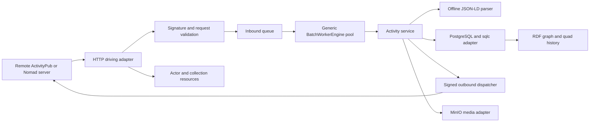

# ActivityPub and Nomad Quad Store Architecture Blueprint

This blueprint describes what the Sprezz federation server does, which responsibilities belong to each subsystem, and how those subsystems collaborate. It is a functional specification rather than an implementation guide. Package names, SQL statements, generated code, and test doubles belong in the source tree and are intentionally omitted here.

## 1. Product Purpose

Sprezz is a multi-tenant ActivityPub and Zot6/Nomad federation server. It accepts signed remote activities, stores their complete historical representations as RDF graphs and quads, exposes ActivityPub discovery and collection resources, and delivers local activities to remote inboxes.

The system must support the following functional outcomes:

- Receive ActivityPub and Zot6-compatible JSON-LD activities through HTTP.
- Reject unauthenticated, stale, malformed, oversized, or blocked requests before persistence.
- Deduplicate an activity globally while recording every local tenant and actor inbox that received it.
- Process accepted activities asynchronously and preserve each accepted representation as an immutable graph version.
- Convert JSON-LD into RDF quads using embedded contexts and deterministic blank-node identifiers.
- Resolve and expose static ActivityPub identities and Nomad identities without coupling either identity model to one hostname.
- Serve actor resources, inboxes, outboxes, followers, and following collections.
- Sign and deliver outbound activities to remote inboxes.
- Store federated media in MinIO when a media workflow requests object storage.

## 2. System Behavior

```mermaid
flowchart LR
    Remote[Remote ActivityPub or Nomad server] --> HTTP[HTTP driving adapter]
    HTTP --> Verify[Signature and request validation]
    Verify --> Queue[Inbound queue]
    Queue --> Worker[Generic BatchWorkerEngine pool]
    Worker --> Service[Activity service]
    Service --> Parser[Offline JSON-LD parser]
    Service --> Store[PostgreSQL and sqlc adapter]
    Store --> Graph[RDF graph and quad history]
    HTTP --> Collections[Actor and collection resources]
    Service --> Outbound[Signed outbound dispatcher]
    Outbound --> Remote
    Service --> Media[MinIO media adapter]
```

The request path performs validation and durable queueing only. Parsing, graph persistence, identity enrichment, and downstream delivery happen asynchronously unless a specific operation explicitly requires an immediate read.

## 3. Architectural Boundaries

### 3.1 Driving Adapters

Driving adapters translate external requests into application operations.

The HTTP adapter partitions incoming network traffic into two distinct, isolated routing planes to protect system namespaces and maintain protocol immutability:

#### 3.1.1 The Canonical Protocol Plane (Machine-to-Machine)

All machine-to-machine federation protocol resources and endpoints utilize stable, immutable machine identifiers as their absolute anchors to guarantee graph structural integrity across handle mutations. To optimize database index performance, actor identifiers use random tokens while transactional event streams utilize chronologically ordered vectors.

- **Canonical Actor ID (`@id`)**: `https://<domain>/actor/<uuidv4>` (Utilizes UUIDv4 for static, long-lived entity stability)
- **Actor Inbox**: `https://<domain>/actor/<uuid>/inbox`
- **Actor Outbox**: `https://<domain>/actor/<uuid>/outbox`
- **Followers Collection**: `https://<domain>/actor/<uuid>/followers`
- **Following Collection**: `https://<domain>/actor/<uuid>/following`
- **Activity Reference Permalink**: `https://<domain>/activity/<uuidv7>` (Utilizes time-ordered sequential UUIDv7 tokens to maximize B-Tree insertion performance under heavy streaming throughput)

#### 3.1.2 The Vanity Interaction Plane (Human-to-Machine & Discovery)

Human-readable vanity handles act as discoverable aliases and routing shortcuts. To prevent hazardous root-level namespace collisions (e.g., a user registering a handle like `"actor"`, `"activity"`, `"api"`, `"static"`, or `"health"` and hijacking system routing primitives), all vanity profiles must reside behind designated structural prefix patterns.

- **Web UI Profile Paths**: `https://<domain>/@<username>` and `https://<domain>/~<username>`

#### 3.1.3 Content Negotiation and Redirection

The vanity paths are strictly presentation layers. If a request targets a vanity route (e.g., `https://<domain>/@username`) accompanied by a machine federation header (`Accept: application/activity+json`), the HTTP driving adapter MUST perform an atomic lookup to map the handle to its active UUID on disk and execute a non-breaking `HTTP 303 See Other` redirect straight to the stable Canonical Actor ID (`https://<domain>/actor/<uuid>`). If requested via a standard web browser, it bypasses the redirect and renders the HTML interface view.

The adapter does not parse RDF graph quads, execute raw PostgreSQL statements directly, or decide how history states are versioned. It validates incoming transport layers, extracts routing context signatures, and invokes the relevant core domain port.

### 3.2 Core Domain Services

The activity service coordinates the lifecycle of an accepted activity.

It must:

- Create one immutable graph version for each globally deduplicated activity.
- Parse the payload into quads before committing the graph version.
- Apply deterministic blank-node rewriting before persistence.
- Enrich graph data with Nomad identity relationships when identity information is available.
- Apply audience and actor authorization rules when building timelines or private views.
- Request outbound delivery through a driven port.

The service owns business sequencing and error semantics. It does not own connection pools, HTTP clients, cache implementations, or object-store SDKs.

### 3.3 Driven Ports

Driven ports describe capabilities required by the domain:

- Storage of queues, tenants, identities, graph versions, quads, and collection data.
- High-performance, zero-allocation database stream writing via compact 64-bit integer mappings (`model.QuadID`).
- Conversion of JSON-LD payloads into RDF quads.
- Signed outbound federation.
- Media object storage.

Adapters implement these capabilities without changing domain terminology or leaking driver-specific types into the core.

## 4. Inbound Activity Workflow

### 4.1 Request Acceptance

For every inbox request, the server performs these checks in order:

1. Accept only the configured HTTP method and enforce a maximum body size.
2. Normalize the receiving host and reject a blocked receiving domain.
3. Validate the `Digest` header against the raw request body.
4. Parse the HTTP Signature and require the signed request target, host, date, and digest components.
5. Resolve the remote public key through an HTTPS-only resolver that rejects private, loopback, link-local, and unspecified addresses.
6. Verify the RSA-SHA256 signature and reject stale requests outside the configured freshness window.
7. Parse the JSON activity and derive its activity and object identifiers.
8. Extract the sender actor domain and reject it when it is blocklisted.
9. Enqueue the activity and record the receiving tenant transactionally.
10. Record actor-specific inbox delivery when the request targets an actor inbox.

Invalid requests must not create queue, tenant-delivery, graph, or inbox-delivery records.

### 4.2 Queue Processing

Inbound queue records have four states:

- `pending`: accepted and waiting for a worker.
- `processing`: claimed by a worker.
- `completed`: graph persistence succeeded.
- `failed`: processing failed and the record may be retried according to policy.

The background subsystem orchestrates both ingestion task loops and outbound federation distributions using a unified, type-safe generic scheduling framework (`BatchWorkerEngine[T]`). This engine decouples queue polling, thread-pool resource management, and graceful context cancellations from the concrete execution steps. The unique task behaviors are injected cleanly at initialization using functional closures.

Workers claim records using explicit row-level database locking (`FOR UPDATE SKIP LOCKED`). This guarantees that concurrent execution threads process disjoint batches and prevents race conditions under high load.

The activity identifier is globally unique. Tenant and actor delivery tables provide local fan-out without duplicating graph parsing work.

## 5. Identity and Tenant Functions

### 5.1 Tenant Routing

The receiving hostname identifies the local tenant. Tenant registration is idempotent and occurs within the same transaction as the first delivery record.

The sender hostname is a separate value derived from the verified actor or key identity. It is used for federation policy and blocklist checks, never as a substitute for the receiving tenant.

Tenant-specific delivery records must prevent duplicate `(activity, tenant)` pairs. Actor inbox records must prevent duplicate `(actor, activity)` pairs.

### 5.2 Static ActivityPub Identity

A local actor possesses an immutable Canonical Actor IRI anchored by a unique, randomly generated UUIDv4, a mutable text-based username handle, a multi-tenant server association, and a private cryptographic signing key.

#### 5.2.1 Handle-to-UUID Decoupling Rules

1. **Immutability of the Actor IRI**: The `https://<domain>/actor/<uuidv4>` string serves as the absolute, unchanging object permalink identifier across the fediverse database ecosystem. It must never change.
2. **Mutability of the Handle**: The `preferredUsername` string literal (e.g., `"alice"`) is volatile metadata stored as an RDF edge inside the quad store. If a user modifies their text handle to `"bob"`, the core system generates an outbound ActivityPub `Update(Actor)` activity block. Remote instances update their visual display text mappings against the stable UUIDv4 without destroying historical follow graphs, network edges, or signature validation keys.
3. **WebFinger Routing Resolution**: When an external machine queries `acct:username@domain`, the WebFinger discovery adapter scans the active quad store graph to resolve the *current* pointer matching that text handle, returning the stable Canonical Actor IRI as the ultimate payload reference destination target.

### 5.3 Nomad Identity and Cross-Protocol Mapping

A Nomad identity represents a global, network-wide persona defined by a permanent, immutable cryptographic string token (**Nomad GUID**), a current primary hub, a master public verification key, and zero or more physical clone hubs.

#### Nomadic Identity Topology Rules

1. **Decoupled Identity Abstraction**: The Nomad identity engine operates independently of local hostnames or ActivityPub-specific path rules. The Nomad GUID is persisted exclusively as a property predicate edge (`http://purl.org/zot/protocol/6.0#guid`) mapping an actor subject to a literal value within the immutable RDF event-sourced quad database.
2. **Many-to-One Architectural Mapping**: The system explicitly supports binding the same global Nomad GUID to multiple distinct local or remote Actor URIs (`https://<domain>/actor/<uuidv4>`). This configuration allows a user to establish multiple redundant clone endpoints across disparate server domains (e.g., Server A and Server B) for high-availability operational fallback.
3. **Vanilla ActivityPub Parity**: Each clone hub interacts with standard ActivityPub platforms using its unique local UUIDv4 actor container, distinct cryptographic keys, and regional inbox delivery slots. The quad store maps cross-protocol authority by matching incoming activities to the underlying shared Nomad GUID, allowing disjoint local endpoints to synchronize states, merge activity lineages, and verify cryptographic cross-server credentials seamlessly.

## 6. RDF and Graph Persistence

### 6.1 Graph Versions

Every successfully accepted activity produces an immutable graph version containing:

- The source activity identifier.
- The object identifier.
- The original JSON-LD payload.
- The normalized RDF quads derived from that payload.
- The creation timestamp.

Graph version creation and quad persistence are one database transaction. A parser error, dictionary error, or quad insertion error rolls back the graph version and leaves the queue record retryable.

### 6.2 Dictionary and Quad Store

Subjects, predicates, and objects are mapped to compact numeric dictionary identifiers. The quad store retains graph identity, term identity, and literal status. Dictionary lookups use the Ristretto TinyLFU cache for both URI-to-ID and ID-to-URI directions.

The system utilizes two distinct persistence pathways:

1. `SaveQuads`: Translates unmapped domain string graphs into compact numeric keys using an explicit database insertion fallback routine to prevent `Unique Constraint Violations (SQLSTATE 23505)` during concurrent worker windows.
2. `SaveQuadIDs`: Accepts pre-resolved integer matrices directly, eliminating string heap copies and allocation cycles during batch stream writes.

The PostgreSQL adapter uses pgx v5 for connection pooling and transactions. sqlc-generated queries are the only SQL execution surface; the domain adapter maps generated records into domain models. Transaction rollbacks are context-bound to eliminate orphaned connection sockets.

### 6.3 Blank-Node Stability

The JSON-LD adapter rewrites blank nodes before persistence.

- Root-level nodes receive identifiers scoped to the main object and their structural predicate.
- Nested nodes use hashes of stable structural properties.
- Parser-generated blank-node labels and traversal order must not determine the resulting identifier.
- Reprocessing equivalent payloads must produce equivalent skolemized identifiers.

### 6.4 Context Resolution

ActivityStreams and security contexts are embedded in the executable. The document loader serves approved embedded contexts from memory and rejects all other remote document resolution. This prevents hostile payloads from turning JSON-LD processing into an SSRF mechanism.

## 7. ActivityPub Resources

### 7.1 Actor Resource

`GET /actor/<uuidv4>` returns the latest ActivityPub actor representation for the receiving tenant reconstructed directly from the RDF quad store graph history. Missing or unmapped UUID identifiers return `404 Not Found`. Successful responses MUST emit the canonical ActivityPub media type header (`application/activity+json`).

The server decouples machine processing from human discovery. If an external client targets a public vanity presentation path (e.g., `https://<domain>/@<username>` or `https://<domain>/~<username>`), the server evaluates the request headers:

1. **Machine Federation Client**: Requests featuring a federation-level media type header (`Accept: application/activity+json`) trigger an atomic index lookup and return an immediate `HTTP 303 See Other` redirect pointing straight to the stable Canonical Actor ID (`https://<domain>/actor/<uuidv4>`).
2. **Standard Web Browser**: Requests omitting federation content negotiation parameters bypass the protocol redirect completely and render the human-readable HTML profile interface view.

### 7.2 Inbox and Outbox Collections

Actor inbox and outbox resources return OrderedCollections containing complete ActivityPub activity objects. They are anchored at `https://<domain>/actor/<uuidv4>/inbox` and `https://<domain>/actor/<uuidv4>/outbox` respectively, utilizing the stable UUIDv4 to preserve immutable collection delivery targets across user handle mutations.

Collections serve serialized task payloads from the underlying event ledger rather than reconstructing heavy leaf nodes on the fly. Collection reads support bounded, high-performance pagination. The server MUST enforce structural upper-bound thresholds on requested page sizes and normalize or reject negative offset parameters before querying the storage layer.

### 7.3 Followers and Following Collections

Followers and following resources are exposed at `https://<domain>/actor/<uuidv4>/followers` and `https://<domain>/actor/<uuidv4>/following`. They return OrderedCollections of actor IRIs.

Items are sourced by scanning historical RDF relationship edges matching designated graph predicates (`activitystreams#follower` or `activitystreams#following`). The resolution pipeline filters out literal values, excludes duplicate entries, and preserves stable storage index ordering to guarantee deterministic pagination windows.

### 7.4 Privacy and Audience Rules

Timeline and thread views MUST evaluate the ActivityStreams public audience explicitly. Public activities are eligible for general display. Private activities are eligible only when the requesting actor is present in the addressed audience or has an authorized relationship in the local graph.

The domain service provides a low-complexity, graph-based privacy filtration pipeline. It groups quads by version, validates canonical case-insensitive target namespaces (`activitystreams#to`, `activitystreams#cc`, `activitystreams#audience`, `activitystreams#Public`), and safely prunes unauthorized graphs.

Privacy filtering occurs before collection serialization and before pagination so private records do not affect visible counts or page boundaries.

## 8. Outbound Federation

Outbound delivery is requested through the activity service and performed by a signer adapter.

The signer:

- Builds an HTTP POST for the target inbox.
- Computes a SHA-256 body digest.
- Adds the date, host, digest, and request-target signature components.
- Signs with the local actor's RSA private key.
- Sends the activity using the ActivityPub media type.
- Treats successful 2xx delivery as complete and reports other responses as failures.

The target inbox, actor key identifier, and retry policy are delivery concerns. The signing adapter must not expose private key material in errors or logs.

The long-term design uses the outbound queue for retryable asynchronous delivery. A worker should claim outbound records, apply bounded retries and backoff, and mark terminal failures for operational inspection.

## 9. Media Storage

### 9.1 Infrastructure Isolation

The MinIO adapter stores federated attachments by opaque object name and content type. It creates or verifies the configured bucket before writing an object and returns a stable object location to the caller. Media access is separate from RDF graph persistence.

### 9.2 Content-Addressable Hashing & Operational Rollbacks

Incoming binary attachments are processed using a stack-allocated `io.TeeReader` loop. This pipeline computes a cryptographic SHA-256 content fingerprint on the fly while streaming the data to MinIO, eliminating redundant memory buffering. Media upload actions execute ahead of relational persistence. If a database transaction, quad conversion, or dictionary mapping aborts, a compensating deletion routine triggers automatically to prune orphaned files from the central bucket.

### 9.3 Dynamic Storage Quota Subsystem

1. **Multi-Tenant Accounting**: Storage metrics MUST be audited at the tenant boundary level (`server_tenants`) and aggregated by the distinct ActivityPub actor identifier (`actor_media_ownership.actor_iri`).
2. **Pre-Flight Ingestion Verification**: Driving multi-part adapters MUST perform an isolated database read query of the current storage utilization footprint *before* allocating chunks or initializing a MinIO multi-part chunked upload sequence.
3. **Hard Ceiling Thresholds**: If a request's incoming payload `header.Size` causes a tenant or actor to cross its dynamically allocated threshold envelope, the execution path MUST drop the stream immediately and reject the request with HTTP Status `413 Payload Too Large`.

## 10. Operational Requirements

PostgreSQL is the system of record. A pgx connection pool must:

- Validate connectivity during startup.
- Bound maximum and minimum connections.
- Bound connection lifetime.
- Close cleanly during shutdown.

The database schema is installed during clean Compose initialization. Existing database volumes require an explicit migration or schema-application step because initialization scripts do not rerun for an already-initialized volume.

The service exposes a health endpoint suitable for container orchestration. Logs may include activity identifiers, tenant domains, queue states, and attempt counts, but must exclude request signatures, private keys, and full untrusted payloads.

## 11. Verification Criteria

The implementation is functionally aligned with this blueprint when the following checks pass:

- A clean database starts with all required tables, indexes, and enum types.
- A valid signed inbox request is accepted once and is safely deduplicated on replay.
- Invalid signatures, mismatched digests, stale dates, blocked domains, malformed JSON, and oversized bodies are rejected before queue insertion.
- Concurrent workers claim disjoint queue records.
- High-throughput streaming operations leverage integer-based `QuadID` structures to isolate string heap replication from the database engine.
- A parser or quad persistence failure leaves no orphaned graph version.
- Equivalent JSON-LD payloads produce stable blank-node identifiers.
- Actor, inbox, outbox, followers, and following resources return the required ActivityPub shapes and media types.
- Private activities are excluded from unauthorized collection results.
- Outbound requests contain verifiable RSA signatures and body digests.
- Nomad identity clones can be registered repeatedly without duplicate records.
- pgx/sqlc integration tests cover UUIDs, JSONB, PostgreSQL arrays, transactions, and row-locking behavior.
- A parser or quad persistence failure leaves no orphaned graph version.

## 12. Implementation Status

The repository currently provides the hexagonal ports, HTTP adapters, signed inbound verification, tenant delivery records, JSON-LD parsing with embedded contexts, deterministic blank-node rewriting, pgx/sqlc PostgreSQL access, actor and collection endpoints, the type-safe generic `BatchWorkerEngine` background framework, a fully functional asynchronous outbound queue worker loop, a signed outbound dispatcher, a high-performance content-addressed MinIO streaming adapter featuring concurrent SHA-256 hashing, and a transaction-isolated database persistence mapping engine.

The remaining architectural work is to:

- Connect the completed multi-part attachment media workflow to a concrete driving application use case.
- Apply full privacy-aware timeline traversal filters across your indexed collection resources.
- Add PostgreSQL integration coverage for transaction and concurrency guarantees.
- Implement **Pre-Flight Storage Quota Queries** inside `internal/adapters/out/postgres` to aggregate current byte usage per `tenant_id`.
- Create **Dynamic Tenant Limits Configuration Schema Table** (`tenant_storage_policies`) to manage storage rules over SQL instead of hardcoded app constants.
- Add **Quota Verification Guard Middleware** or service verification hooks to intercept driving multipart form file extraction channels inside `internal/adapters/in/http`.
