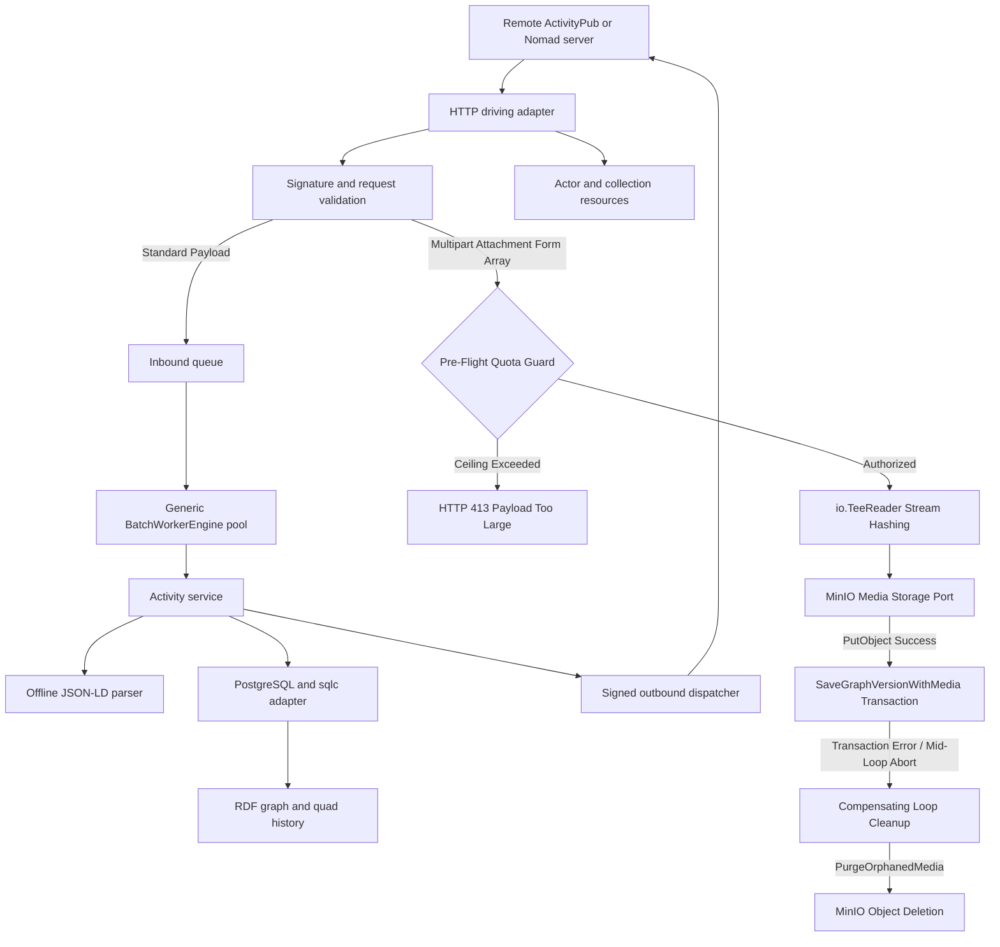
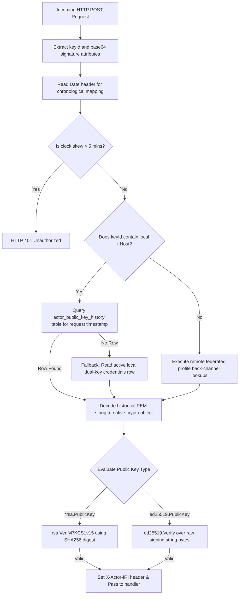
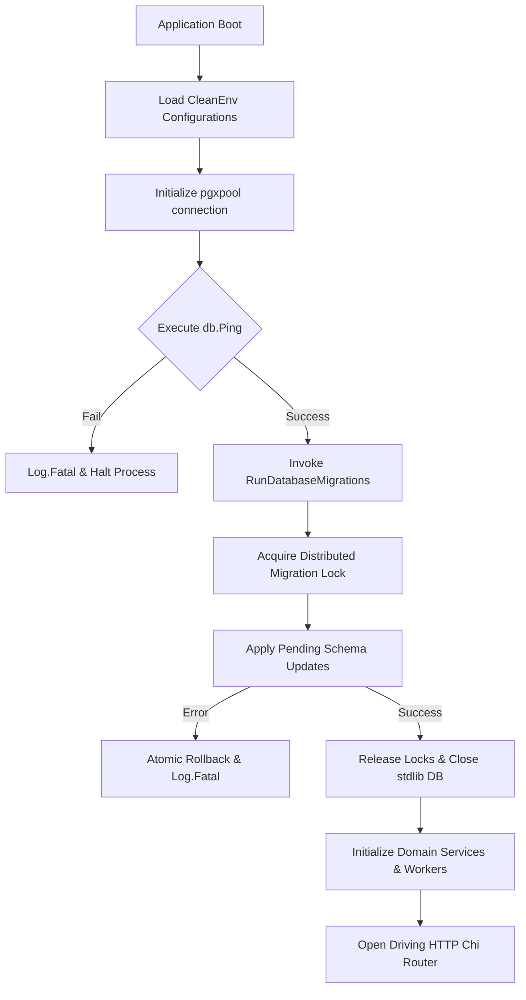

# ActivityPub and Nomad Quad Store Architecture Blueprint

This blueprint describes what the Sprezz federation server does, which responsibilities belong to each subsystem, and how those subsystems collaborate. It is a functional specification rather than an implementation guide. Package names, SQL statements, generated code, and test doubles belong in the source tree and are intentionally omitted here.

## 1. Product Purpose

Sprezz is a multi-tenant ActivityPub and Zot6/Nomad federation server. It accepts signed remote activities, stores their complete historical representations as RDF graphs and quads, exposes ActivityPub discovery and collection resources, and delivers local activities to remote inboxes.

The system must support the following functional outcomes:

- Receive ActivityPub and Zot6-compatible JSON-LD activities through HTTP.
- Reject unauthenticated, stale, malformed, oversized, or blocked requests before persistence.
- Deduplicate an activity globally while recording every local tenant and actor inbox that received it.
- Process accepted activities asynchronously and preserve each accepted representation as an immutable graph version.
- Convert JSON-LD into RDF quads using embedded contexts and deterministic blank-node identifiers.
- Resolve and expose static ActivityPub identities and Nomad identities without coupling either identity model to one hostname.
- Serve actor resources, inboxes, outboxes, followers, and following collections.
- Sign and deliver outbound activities to remote inboxes.
- Store federated media in MinIO when a media workflow requests object storage.

## 2. System Behavior


```mermaid
flowchart TD
    Remote[Remote ActivityPub or Nomad server] --> HTTP[HTTP driving adapter]
    HTTP --> Verify[Signature and request validation]

    %% Standard Path
    Verify -->|Standard Payload| Queue[Inbound queue]
    Queue --> Worker[Generic BatchWorkerEngine pool]
    Worker --> Service[Activity service]
    Service --> Parser[Offline JSON-LD parser]
    Service --> Store[PostgreSQL and sqlc adapter]
    Store --> Graph[RDF graph and quad history]
    Service --> Outbound[Signed outbound dispatcher]
    Outbound --> Remote

    %% Multipart Upload Loop Path
    Verify -->|Multipart Attachment Form Array| QuotaGuard{Pre-Flight Quota Guard}
    QuotaGuard -->|Ceiling Exceeded| Fail413[HTTP 413 Payload Too Large]
    QuotaGuard -->|Authorized| TeeStream[io.TeeReader Stream Hashing]
    TeeStream --> MediaPort[MinIO Media Storage Port]
    MediaPort -->|PutObject Success| AtomicDB[SaveGraphVersionWithMedia Transaction]

    %% Rollback Branch
    AtomicDB -->|Transaction Error / Mid-Loop Abort| Rollback[Compensating Loop Cleanup]
    Rollback -->|PurgeOrphanedMedia| DeleteMedia[MinIO Object Deletion]

    HTTP --> Collections[Actor and collection resources]
```

The request path performs validation and durable queueing only for standard non-media payloads. Parsing, graph persistence, identity enrichment, and downstream delivery happen asynchronously unless a specific operation explicitly requires an immediate read.

When a multipart media payload is intercepted, the driving HTTP adapter intercepts the pipeline to run synchronous **Pre-Flight Ingestion Verification** loops. It maps byte footprints against dynamic ledger thresholds before executing resource-isolated `io.TeeReader` operations, streaming files directly to the object storage node ahead of transactional relational database commits. If any single tracking transaction fails or encounters unexpected errors mid-loop, a tight backward-walking **Compensating Rollback** walker fires instantly to clean up and delete any raw blobs generated during that specific multi-part lifecycle request.

## 3. Architectural Boundaries

### 3.1 Driving Adapters

Driving adapters translate external requests into application operations.

The HTTP adapter partitions incoming network traffic into two distinct, isolated routing planes to protect system namespaces and maintain protocol immutability:

#### 3.1.1 The Canonical Protocol Plane (Machine-to-Machine)

All machine-to-machine federation protocol resources and endpoints utilize stable, immutable machine identifiers as their absolute anchors to guarantee graph structural integrity across handle mutations. To optimize database index performance, actor identifiers use random tokens while transactional event streams utilize chronologically ordered vectors.

- **Canonical Actor ID (`@id`)**: `https://<domain>/actor/<uuidv4>` (Utilizes UUIDv4 for static, long-lived entity stability)
- **Actor Inbox**: `https://<domain>/actor/<uuid>/inbox`
- **Actor Outbox**: `https://<domain>/actor/<uuid>/outbox`
- **Followers Collection**: `https://<domain>/actor/<uuid>/followers`
- **Following Collection**: `https://<domain>/actor/<uuid>/following`
- **Activity Reference Permalink**: `https://<domain>/activity/<uuidv7>` (Utilizes time-ordered sequential UUIDv7 tokens to maximize B-Tree insertion performance under heavy streaming throughput)

#### 3.1.2 The Vanity Interaction Plane (Human-to-Machine & Discovery)

Human-readable vanity handles act as discoverable aliases and routing shortcuts. To prevent hazardous root-level namespace collisions (e.g., a user registering a handle like `"actor"`, `"activity"`, `"api"`, `"static"`, or `"health"` and hijacking system routing primitives), all vanity profiles must reside behind designated structural prefix patterns.

- **Web UI Profile Paths**: `https://<domain>/@<username>` and `https://<domain>/~<username>`

#### 3.1.3 Content Negotiation and Redirection

The vanity paths are strictly presentation layers. If a request targets a vanity route (e.g., `https://<domain>/@username`) accompanied by a machine federation header (`Accept: application/activity+json`), the HTTP driving adapter MUST perform an atomic lookup to map the handle to its active UUID on disk and execute a non-breaking `HTTP 303 See Other` redirect straight to the stable Canonical Actor ID (`https://<domain>/actor/<uuid>`). If requested via a standard web browser, it bypasses the redirect and renders the HTML interface view.

The adapter does not parse RDF graph quads, execute raw PostgreSQL statements directly, or decide how history states are versioned. It validates incoming transport layers, extracts routing context signatures, and invokes the relevant core domain port.

### 3.2 Core Domain Services

The activity service coordinates the lifecycle of an accepted activity.

It must:

- Create one immutable graph version for each globally deduplicated activity.
- Parse the payload into quads before committing the graph version.
- Apply deterministic blank-node rewriting before persistence.
- Enrich graph data with Nomad identity relationships when identity information is available.
- Apply audience and actor authorization rules when building timelines or private views.
- Request outbound delivery through a driven port.

The service owns business sequencing and error semantics. It does not own connection pools, HTTP clients, cache implementations, or object-store SDKs.

### 3.3 Driven Ports

Driven ports describe capabilities required by the domain. To adhere to idiomatic Go development philosophies, abstract service layer contracts are aggregated cleanly within a singular package namespace (`internal/domain/port/`):

- Storage of queues, tenants, identities, graph versions, quads, and collection data.
- High-performance, zero-allocation database stream writing via compact 64-bit integer mappings (`model.QuadID`).
- Conversion of JSON-LD payloads into RDF quads.
- Signed outbound federation.
- Media object storage.

Adapters implement these capabilities without changing domain terminology or leaking driver-specific types into the core.

## 4. Inbound Activity and Cryptographic Verification Workflow

### 4.1 Request Acceptance and Native Asymmetric Verification

For every inbox request, the server executes a native, standard-library driven signature verification pipeline entirely decoupled from external, third-party cryptographic frameworks.


```mermaid
flowchart TD
    In[Incoming HTTP POST Request] --> ParseHeader[Extract keyId and base64 signature attributes]
    ParseHeader --> ExtractDate[Read Date header for chronological mapping]
    ExtractDate --> CheckSkew{Is clock skew > 5 mins?}
    CheckSkew -- Yes --> Fail401[HTTP 401 Unauthorized]
    CheckSkew -- No --> CheckHost{Does keyId contain local r.Host?}

    CheckHost -- Yes --> FetchHistory[Query actor_public_key_history table for request timestamp]
    FetchHistory -- Row Found --> DecodePEM[Decode historical PEM string to native crypto object]
    FetchHistory -- No Row --> FetchActive[Fallback: Read active local dual-key credentials row]
    FetchActive --> DecodePEM

    CheckHost -- No --> FetchRemote[Execute remote federated profile back-channel lookups]
    FetchRemote --> DecodePEM

    DecodePEM --> DetectAlgo{Evaluate Public Key Type}
    DetectAlgo -- *rsa.PublicKey --> VerifyRSA[rsa.VerifyPKCS1v15 using SHA256 digest]
    DetectAlgo -- ed25519.PublicKey --> VerifyEd[ed25519.Verify over raw signing string bytes]

    VerifyRSA -- Valid --> InjectHeader[Set X-Actor-IRI header & Pass to handler]
    VerifyEd -- Valid --> InjectHeader
```

1. **Clock Skew Anti-Replay Guard**: The system reads the standard HTTP `Date` header. If the timestamp deviates from the current system context by more than 5 minutes, the perimeter layer terminates the socket immediately.
2. **Chronological Key History Window Routing**: If the signature's `keyId` points to a local domain, the system uses a compound index lookup to extract the public key that was valid *at the exact time the message was signed*. If no historical block is archived, it falls back to the current active credentials row.
3. **Multi-Algorithm Validation Decoupling**: The extracted PEM string is decoded natively. The verification engine branches dynamically: **RSA signatures** are evaluated via `rsa.VerifyPKCS1v15` using pre-calculated SHA-256 digests, while modern **Ed25519 signatures** bypass hashing entirely and verify raw text bytes directly via `ed25519.Verify`.
4. **Identity Assertion**: Upon successful cryptographic validation, the verifier binds the canonical sender to the request context via the `X-Actor-IRI` header, signaling downstream filters.

### 4.2 Split Hexagonal Queue Processing Boundaries

The system decouples asynchronous background scheduling mechanics from domain use cases by segregating polling execution directions across explicit hexagonal boundaries:

- **The Generic Concurrency Frame (`internal/pkg/workers/`)**: Houses an abstraction-bound thread-pool utility (`Config` and `BatchEngine[T]`) operating on channel primitives and generic types `[T any]`. It manages lifecycle loops and graceful context cancellations (`<-ctx.Done()`) with zero awareness of ActivityPub vocabularies or SQL schemas.
- **The Driving Inbound Worker (`internal/adapters/in/worker/inbound_worker.go`)**: Acts as a primary entry channel. It wraps the generic engine to pull pending tasks from database logs and actively drives execution downward into the core application logic via `ActivityServicePort`.
- **The Driven Outbound Worker (`internal/adapters/out/federation/outbound_worker.go`)**: Acts as a secondary destination integration. It wraps the generic engine to pull outbound transport requests, resolves structural dual-keys from the lockbox layer, and dispatches signed activities out to external remote environments via `OutboundDispatcher`.

## 5. Identity, Key Rotation, and Tenant Functions

### 5.1 Tenant Routing and File Naming Symmetries

To guarantee high scannability and separate technical utility components from active HTTP controllers, the driving infrastructure layer enforces strict file name suffix structures:

- **Driving Entry Controllers (`*_handler.go`)**: All files directly exposing an `http.HandlerFunc` or returning network payloads use this identifier (`inbox_handler.go`, `actor_handler.go`, `webfinger_handler.go`).
- **Technical Adapters (`*_verifier.go` / `http.go`)**: Standalone helper modules or cryptographic parsing layers retain pure operational descriptors without handler suffixes (`signature_verifier.go`, `http.go`).

### 5.2 Static ActivityPub Identity and Handle-to-UUID Decoupling

A local actor possesses an immutable Canonical Actor IRI anchored by a unique, randomly generated UUIDv4, a mutable text-based username handle, a multi-tenant server association, and an active private cryptographic signing key block.

1. **Immutability of the Actor IRI**: The `https://<domain>/actor/<uuidv4>` string serves as the absolute, unchanging object permalink identifier across the fediverse database ecosystem. It must never change.
2. **Mutability of the Handle**: The `preferredUsername` string literal (e.g., `"alice"`) is volatile metadata stored as an RDF edge inside the quad store. If a user modifies their text handle to `"bob"`, the core system generates an outbound ActivityPub `Update(Actor)` activity block. Remote instances update their visual display text mappings against the stable UUIDv4 without destroying historical follow graphs, network edges, or signature validation keys.
3. **WebFinger Routing Resolution**: When an external machine queries `acct:username@domain`, the WebFinger discovery adapter scans the active quad store graph to resolve the *current* pointer matching that text handle, returning the stable Canonical Actor IRI as the ultimate payload reference destination target.

### 5.3 Cryptographic Key Rotation and Archiving Lifecycle

To maintain complete audit trails across long-term data ledgers, the core domain enforces strict separation between an actor's active private signing block and their historical verification footprint.

```text
[Key Rotation Event Triggered]
             │
             ├──> 1. Copy active local public keys from memory
             ├──> 2. Insert into actor_public_key_history table with [valid_from, NOW()]
             ├──> 3. Generate brand-new RSA-2048 and Ed25519 keys via model.MintNewKeyPair()
             └──> 4. Overwrite local_actor_credentials row (Safely destroying old private keys)
```

1. **Principle of Least Privilege Key Isolation**: Public-facing discovery boundaries (such as WebFinger) must never pull or touch private cryptographic arrays. WebFinger operates strictly as a locator, mapping string vectors to immutable UUIDv4 paths. Cryptographic payloads are delivered exclusively by the actor profile resource handler.
2. **Atomic Private Overwriting**: When a local actor profile executes a rotation sequence, the application copies the current public keys and commits them to `actor_public_key_history`. It then mints a fresh pair using `model.MintNewKeyPair()`, completely overwriting the row in `local_actor_credentials`. The old private key material is erased permanently from system memory.
3. **Remote Key Lifecycle Exclusions**: The historical ledger tracks *local server actors only*. When external foreign profiles rotate keys, they propagate standard ActivityPub `Update(Actor)` activities across the network. Sprezz catches these events, drops the stale remote cached profile rows from its local triple-store graph, and refreshes the target key over the wire dynamically.

### 5.4 Nomad Identity and Cross-Protocol Mapping

A Nomad identity represents a global, network-wide persona defined by a permanent, immutable cryptographic string token (**Nomad GUID**), a current primary hub, a master public verification key, and zero or more physical clone hubs.

1. **Decoupled Identity Abstraction**: The Nomad identity engine operates independently of local hostnames or ActivityPub-specific path rules. The Nomad GUID is persisted exclusively as a property predicate edge (`http://purl.org/zot/protocol/6.0#guid`) mapping an actor subject to a literal value within the immutable RDF event-sourced quad database.
2. **Many-to-One Architectural Mapping**: The system explicitly supports binding the same global Nomad GUID to multiple distinct local or remote Actor URIs (`https://<domain>/actor/<uuidv4>`). This configuration allows a user to establish multiple redundant clone endpoints across disparate server domains (e.g., Server A and Server B) for high-availability operational fallback.
3. **Vanilla ActivityPub Parity**: Each clone hub interacts with standard ActivityPub platforms using its unique local UUIDv4 actor container, distinct cryptographic keys, and regional inbox delivery slots. The quad store maps cross-protocol authority by matching incoming activities to the underlying shared Nomad GUID, allowing disjoint local endpoints to synchronize states, merge activity lineages, and verify cryptographic cross-server credentials seamlessly.

## 6. RDF and Graph Persistence

### 6.1 Graph Versions

Every successfully accepted activity produces an immutable graph version containing:

- The source activity identifier.
- The object identifier.
- The original JSON-LD payload.
- The normalized RDF quads derived from that payload.
- The creation timestamp.

Graph version creation and quad persistence are one database transaction. A parser error, dictionary error, or quad insertion error rolls back the graph version and leaves the queue record retryable.

### 6.2 Dictionary and Quad Store

Subjects, predicates, and objects are mapped to compact numeric dictionary identifiers. The quad store retains graph identity, term identity, and literal status. Dictionary lookups use the Ristretto TinyLFU cache for both URI-to-ID and ID-to-URI directions.

The system utilizes two distinct persistence pathways:

1. `SaveQuads`: Translates unmapped domain string graphs into compact numeric keys using an explicit database insertion fallback routine to prevent `Unique Constraint Violations (SQLSTATE 23505)` during concurrent worker windows.
2. `SaveQuadIDs`: Accepts pre-resolved integer matrices directly, eliminating string heap copies and allocation cycles during batch stream writes.

The PostgreSQL adapter uses pgx v5 for connection pooling and transactions. sqlc-generated queries are the only SQL execution surface; the domain adapter maps generated records into domain models. Transaction rollbacks are context-bound to eliminate orphaned connection sockets.

### 6.3 Blank-Node Stability

The JSON-LD adapter rewrites blank nodes before persistence.

- Root-level nodes receive identifiers scoped to the main object and their structural predicate.
- Nested nodes use hashes of stable structural properties.
- Parser-generated blank-node labels and traversal order must not determine the resulting identifier.
- Reprocessing equivalent payloads must produce equivalent skolemized identifiers.

### 6.4 Context Resolution

ActivityStreams and security contexts are embedded in the executable. The document loader serves approved embedded contexts from memory and rejects all other remote document resolution. This prevents hostile payloads from turning JSON-LD processing into an SSRF mechanism.

## 7. ActivityPub Resources

### 7.1 Actor Resource

`GET /actor/<uuidv4>` returns the latest ActivityPub actor representation for the receiving tenant reconstructed directly from the RDF quad store graph history. Missing or unmapped UUID identifiers return `404 Not Found`. Successful responses MUST emit the canonical ActivityPub media type header (`application/activity+json`).

The server decouples machine processing from human discovery. If an external client targets a public vanity presentation path (e.g., `https://<domain>/@<username>` or `https://<domain>/~<username>`), the server evaluates the request headers:

1. **Machine Federation Client**: Requests featuring a federation-level media type header (`Accept: application/activity+json`) trigger an atomic index lookup and return an immediate `HTTP 303 See Other` redirect pointing straight to the stable Canonical Actor ID (`https://<domain>/actor/<uuidv4>`).
2. **Standard Web Browser**: Requests omitting federation content negotiation parameters bypass the protocol redirect completely and render the human-readable HTML profile interface view.

### 7.2 Inbox and Outbox Collections

Actor inbox and outbox resources return OrderedCollections containing complete ActivityPub activity objects. They are anchored at `https://<domain>/actor/<uuidv4>/inbox` and `https://<domain>/actor/<uuidv4>/outbox` respectively, utilizing the stable UUIDv4 to preserve immutable collection delivery targets across user handle mutations.

Collections serve serialized task payloads from the underlying event ledger rather than reconstructing heavy leaf nodes on the fly. Collection reads support bounded, high-performance pagination. The server MUST enforce structural upper-bound thresholds on requested page sizes and normalize or reject negative offset parameters before querying the storage layer.

### 7.3 Followers and Following Collections

Followers and following resources are exposed at `https://<domain>/actor/<uuidv4>/followers` and `https://<domain>/actor/<uuidv4>/following`. They return OrderedCollections of actor IRIs.

Items are sourced by scanning historical RDF relationship edges matching designated graph predicates (`activitystreams#follower` or `activitystreams#following`). The resolution pipeline filters out literal values, excludes duplicate entries, and preserves stable storage index ordering to guarantee deterministic pagination windows.

### 7.4 Privacy and Audience Rules

Timeline and thread views MUST evaluate the ActivityStreams public audience explicitly. Public activities are eligible for general display. Private activities are eligible only when the requesting actor is present in the addressed audience or has an authorized relationship in the local graph.

The domain service provides a low-complexity, graph-based privacy filtration pipeline. It groups quads by version, validates canonical case-insensitive target namespaces (`activitystreams#to`, `activitystreams#cc`, `activitystreams#audience`, `activitystreams#Public`), and safely prunes unauthorized graphs.

Privacy filtering occurs before collection serialization and before pagination so private records do not affect visible counts or page boundaries.

## 8. Outbound Federation and Dual-Key Alignment

Outbound delivery tasks are requested through the activity service and performed asynchronously by the driven `out/federation` worker subsystem.

- **Stable RSA Outbound Core**: To maintain maximum delivery compatibility with 100% of the active fediverse network, outbound transmissions are locked to generating legacy **RSA-SHA256 signatures** via `rsa.SignPKCS1v15`.
- **Dual-Key Interface Alignment**: To future-proof the outbound transmission adapters without requiring downstream schema or architectural modifications later, all dispatcher port signatures (`OutboundDispatcher.ForwardFederatedActivity`) natively accept **both the RSA and Ed25519 private key strings collectively** inside their parameter trees. Modern cryptographic components are loaded from disk concurrently and sit idle in memory, completely prepared to handle future signature protocol upgrades.
- **Privacy Filtration Placement**: Privacy scoping and audience target pruning occur inside the domain logic *before* payloads reach the database serialization and pagination window stages, ensuring that unauthorized graph versions never leak across outbound transport streams.
- **Error and Log Masking**: The signing adapter handles low-level cryptographic execution and must never expose private key materials or raw untrusted payloads in errors or system logs.

## 9. Media Storage

### 9.1 Infrastructure Isolation

The MinIO adapter stores federated attachments by opaque object name and content type. It creates or verifies the configured bucket before writing an object and returns a stable object location to the caller. Media access is separate from RDF graph persistence.

### 9.2 Content-Addressable Hashing & Operational Rollbacks

Incoming binary attachments are processed using a stack-allocated `io.TeeReader` loop. This pipeline computes a cryptographic SHA-256 content fingerprint on the fly while streaming the data to MinIO, eliminating redundant memory buffering. Media upload actions execute ahead of relational persistence.

If a database transaction, quad conversion, or dictionary mapping aborts, an automatic **Operational Rollback Mechanism** invokes a sequential compensating deletion routine (`PurgeOrphanedMedia`). This walker walks backward through the execution tracking manifest to immediately drop all stranded files from the central bucket, preserving clean storage boundaries.

### 9.3 Dynamic Storage Quota Subsystem

1. **Multi-Tenant Accounting**: Storage metrics MUST be audited at the tenant boundary level (`server_tenants`) and aggregated by the distinct ActivityPub actor identifier (`actor_media_ownership.actor_iri`).
2. **Pre-Flight Ingestion Verification**: Driving multi-part adapters MUST perform an isolated database read query of the current storage utilization footprint *before* allocating chunks or initializing a MinIO multi-part chunked upload sequence.
3. **Hard Ceiling Thresholds**: If a request's incoming payload `header.Size` causes a tenant or actor to cross its dynamically allocated threshold envelope, the execution path MUST drop the stream immediately, execute immediate rollback purges on any previously processed items in the loop, and reject the request with HTTP Status `413 Payload Too Large`.

### 9.4 Multipart Media Form Attachment Upload Loop

To safely swallow multiple concurrent attachments under streaming loads, the incoming HTTP Driving Adapter plane implements a strict, sequential multi-part form loop:

```text
[Incoming HTTP Multipart Payload]
                │
                ├── r.MultipartForm.File["attachment"] (Array Matrix Lookup)
                │
     ┌──────────┴──────────┐
     ▼                     ▼
[Attachment 1]        [Attachment 2]  ... (Processed Sequentially for Memory Isolation)
     │                     │
     ├── 1. Pre-Flight Ingestion Quota Audit (Hard Ceiling Guard)
     ├── 2. Open Stream Block Allocation (32MB Max In-Memory Cache Buffer)
     ├── 3. Stack-Allocated Hashing (io.TeeReader stream to MinIO)
     └── 4. Atomic Transaction Group Commit (SaveGraphVersionWithMedia via Core Service)
                │
                └─► [Any Failure Condition Triggered Mid-Loop]
                            │
                            └─► Execute Compensating Rollback (PurgeOrphanedMedia)
```

1. **Memory Isolation Strategy**: The handler processes files using an explicit `for...range` loop instead of unbounded concurrent routines. File descriptors are deterministically closed at the footer of each iteration block rather than deferred, preventing unmanaged socket spikes and allocation leaks during massive multi-part batch intake.
2. **Atomic Context Coupling**: Every attachment item maps its metadata payload, object identifiers, binary storage paths, and calculated SHA-256 signatures down to a unified transaction block (`SaveGraphVersionWithMedia`) where quads and files are registered within a context-bound database connection slice.

## 10. Operational Requirements

PostgreSQL is the system of record. A pgx connection pool must:

- Validate connectivity during startup.
- Bound maximum and minimum connections.
- Bound connection lifetime.
- Close cleanly during shutdown.

The database schema is installed during clean Compose initialization. Existing database volumes require an explicit migration or schema-application step because initialization scripts do not rerun for an already-initialized volume.

The service exposes a health endpoint suitable for container orchestration. Logs may include activity identifiers, tenant domains, queue states, and attempt counts, but must exclude request signatures, private keys, and full untrusted payloads.

## 11. Verification Criteria

The implementation is functionally aligned with this blueprint when the following checks pass:

- A clean database starts with all required tables, indexes, and enum types.
- A valid signed inbox request is accepted once and is safely deduplicated on replay.
- Invalid signatures, mismatched digests, stale dates, blocked domains, malformed JSON, and oversized bodies are rejected before queue insertion.
- Concurrent workers claim disjoint queue records.
- High-throughput streaming operations leverage integer-based `QuadID` structures to isolate string heap replication from the database engine.
- A parser or quad persistence failure leaves no orphaned graph version.
- Equivalent JSON-LD payloads produce stable blank-node identifiers.
- Actor, inbox, outbox, followers, and following resources return the required ActivityPub shapes and media types.
- Private activities are excluded from unauthorized collection results.
- Outbound requests contain verifiable RSA signatures and body digests.
- Nomad identity clones can be registered repeatedly without duplicate records.
- pgx/sqlc integration tests cover UUIDs, JSONB, PostgreSQL arrays, transactions, and row-locking behavior.
- A parser or quad persistence failure leaves no orphaned graph version.

### 11.1 Multipart Media Form Attachment Upload Loop Criteria

- **Array Param Intake Validation**: The HTTP driving adapter successfully parses multi-part form requests where multiple individual files populate the same `attachment` array parameter key, iterating through them sequentially to prevent execution thread OOM crashes.
- **Pre-Flight Hard-Ceiling Rejection**: Incoming payloads featuring a `header.Size` configuration that exceeds an actor or tenant's active threshold ledger slice immediately drop the incoming socket and return an HTTP `413 Payload Too Large` status code without initiating a MinIO chunk allocation stream.
- **Zero-Allocation Inline Hashing Verification**: Media attachments are validated against binary tampering using standard `io.TeeReader` piping layers, ensuring that SHA-256 string fingerprints are populated entirely on-the-fly during the data-streaming window to MinIO.
- **Backward-Walking Rollback Guarantee**: When an upload request containing 3 valid files encounters a transactional database failure or infrastructure timeout on the 3rd item, the system executes an automated reverse loop (`PurgeOrphanedMedia`) to target, locate, and delete file 1 and file 2 from the central bucket bucket space, leaving zero stranded storage orphans behind.

## 12. Database Migration Subsystem

The Sprezz server enforces programmatic database schema evolution to guarantee structural parity across multi-tenant deployments without relying on external orchestration tools or shell dependencies inside production container images. The migration subsystem operates as an integrated lifecycle hook that sits ahead of all core domain services, driving adapters, and background engines.

### 12.1 Structural and Compilation Boundaries

1. **Single Source of Truth**: Schema state is defined solely by sequential SQL migration files. The application's object-relational mapping layer (`sqlc`) points directly to the active migrations directory as its schema source. This prevents the emergence of split-brain schemas or disconnected metadata definitions.
2. **Binary Embedding (`go:embed`)**: All database schema evolution scripts (`.sql`) are baked directly into the Go executable binary at compile time using static filesystem embedding. The production container image requires no loose SQL scripts on disk and does not expose a database migration CLI or raw binary tooling within the runtime shell environment.
3. **Driver Isolation & Interoperability**: While the application leverages high-performance, transaction-bound connection pools (`pgx/v5`) for routine operational pathways, the migration engine wraps the active pool configuration using a standard compatibility lifecycle driver (`pgx/v5/stdlib`). This allows the migration coordinator to open an atomic, standard-compliant relational socket exclusively for DDL execution without polluting core domain connection pools with long-running schema locks.

### 12.2 Execution Sequencing and Reliability


```mermaid
flowchart TD
    Start[Application Boot] --> Config[Load CleanEnv Configurations]
    Config --> DBConnect[Initialize pgxpool connection]
    DBConnect --> DBPing{Execute db.Ping}
    DBPing -- Fail --> Crash[Log.Fatal & Halt Process]
    DBPing -- Success --> Migrations[Invoke RunDatabaseMigrations]
    Migrations --> CheckLock[Acquire Distributed Migration Lock]
    CheckLock --> RunDDL[Apply Pending Schema Updates]
    RunDDL -- Error --> Rollback[Atomic Rollback & Log.Fatal]
    RunDDL -- Success --> Release[Release Locks & Close stdlib DB]
    Release --> StartServices[Initialize Domain Services & Workers]
    StartServices --> StartServer[Open Driving HTTP Chi Router]
```

1. **Pre-Flight Execution Guard**: Database migrations are invoked immediately after confirming connection pool viability via `db.Ping()`, but strictly *before* initializing any driven adapters, domain services, driving HTTP routers, or background worker threads (`BatchWorkerEngine`).
2. **Fail-Fast Boot Failure**: If a migration script contains syntactic errors, deployment phase discrepancies, or structural failures, the startup sequence issues an immediate `log.Fatalf` command to drop execution and terminate the process. This prevents the server from entering a corrupted execution state where active services target non-existent tables or column definitions.
3. **Transactional DDL Isolation**: Each migration script executes within an explicit database transaction block. If an individual statement fails, the entire migration generation rolls back completely to maintain database schema cleanliness. Non-transactional elements (such as custom Enum typings) are isolated within dedicated statement block boundaries (`-- +goose StatementBegin/End`) to align with PostgreSQL isolation constraints.
4. **Log Masking**: Structural changes and schema initialization phases use strict log masking. Raw SQL arguments, custom schema parameters, and database metadata are prevented from leaking into the standard system logs, preserving information perimeter boundaries.

## 13. Implementation Status

The repository currently provides the hexagonal ports, HTTP adapters, signed inbound verification, tenant delivery records, JSON-LD parsing with embedded contexts, deterministic blank-node rewriting, pgx/sqlc PostgreSQL access, actor and collection endpoints, the type-safe generic `BatchWorkerEngine` background framework, a fully functional asynchronous outbound queue worker loop, a signed outbound dispatcher, a high-performance content-addressed MinIO streaming adapter featuring concurrent SHA-256 hashing, a transaction-isolated database persistence mapping engine, and full privacy-aware timeline traversal filters across indexed collection resources.

Additionally, the **Database Migration Subsystem** is fully operational. It leverages embedded filesystem compilation (`go:embed`), standard runtime interoperability adapters (`pgx/v5/stdlib`), and a fail-fast boot sequence execution block to cleanly isolate structural DDL schema synchronization tasks ahead of downstream worker pools.

The remaining architectural work is to:

- Connect the completed multi-part attachment media workflow to a concrete driving application use case.
- Add PostgreSQL integration coverage for transaction and concurrency guarantees.
- Add **Quota Verification Guard Middleware** or service verification hooks to intercept driving multipart form file extraction channels inside `internal/adapters/in/http`.
