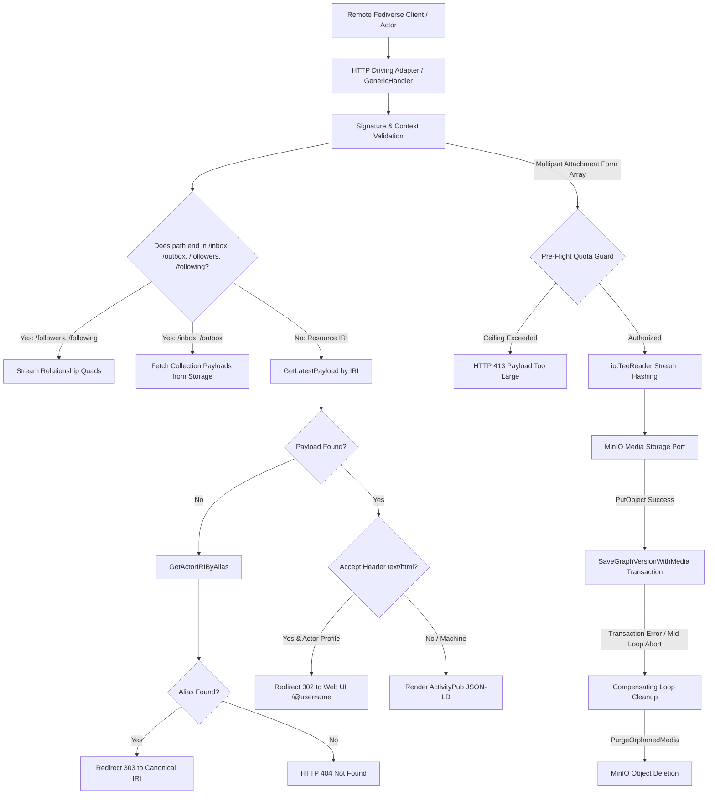
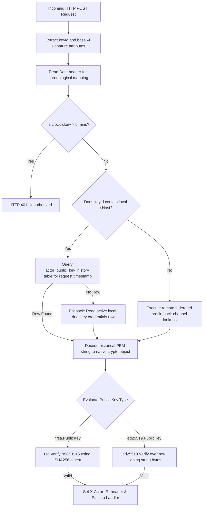
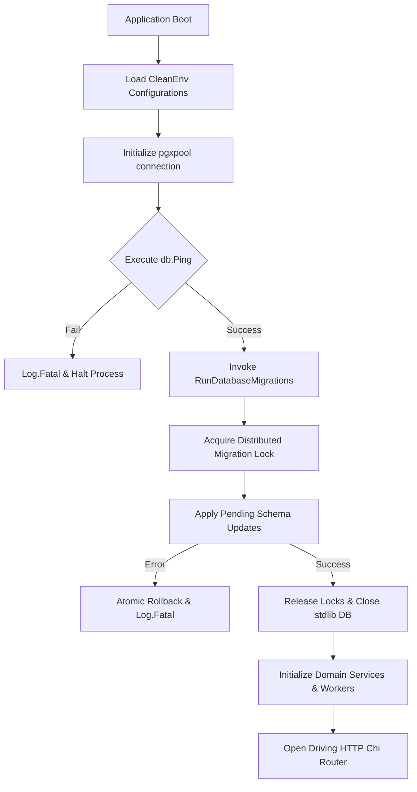

# ActivityPub and Nomad Quad Store Architecture Blueprint

This blueprint describes what the Sprezz federation server does, which responsibilities belong to each subsystem, and how those subsystems collaborate. It is a functional specification rather than an implementation guide. Package names, SQL statements, generated code, and test doubles belong in the source tree and are intentionally omitted here.

## 1. Product Purpose

Sprezz is a multi-tenant ActivityPub and Zot6/Nomad federation server. It accepts signed remote activities, stores their complete historical representations as RDF graphs and quads, exposes ActivityPub discovery and collection resources, and delivers local activities to remote inboxes.

The system must support the following functional outcomes:

- Receive ActivityPub and Zot6-compatible JSON-LD activities through HTTP.
- Reject unauthenticated, stale, malformed, oversized, or blocked requests before persistence.
- Deduplicate an activity globally while recording every local tenant and actor inbox that received it.
- Process accepted activities asynchronously and preserve each accepted representation as an immutable graph version.
- Convert JSON-LD into RDF quads using embedded contexts and deterministic blank-node identifiers.
- Resolve and expose static ActivityPub identities and Nomad identities without coupling either identity model to one hostname.
- Serve actor resources, inboxes, outboxes, followers, and following collections.
- Sign and deliver outbound activities to remote inboxes.
- Store federated media in MinIO when a media workflow requests object storage.

## 2. System Behavior


```mermaid
flowchart TD
    Remote[Remote Fediverse Client / Actor] --> HTTP[HTTP Driving Adapter / GenericHandler]
    HTTP --> Verify[Signature & Context Validation]

    %% Suffix Routing & Payload Lookup
    Verify --> MatchSuffix{Does path end in /inbox, /outbox, /followers, /following?}

    %% Suffix Paths
    MatchSuffix -->|Yes: /followers, /following| ServeRelCollection[Stream Relationship Quads]
    MatchSuffix -->|Yes: /inbox, /outbox| ServePayloadCollection[Fetch Collection Payloads from Storage]

    %% Non-Collection/Resource Path
    MatchSuffix -->|No: Resource IRI| QueryPayload[GetLatestPayload by IRI]
    QueryPayload --> PayloadExists{Payload Found?}

    PayloadExists -->|No| QueryAlias[GetActorIRIByAlias]
    QueryAlias --> AliasExists{Alias Found?}
    AliasExists -->|Yes| RedirectCanonical[Redirect 303 to Canonical IRI]
    AliasExists -->|No| Fail404[HTTP 404 Not Found]

    PayloadExists -->|Yes| CheckAccept{Accept Header text/html?}
    CheckAccept -->|Yes & Actor Profile| RedirectVanity[Redirect 302 to Web UI /@username]
    CheckAccept -->|No / Machine| ServePayload[Render ActivityPub JSON-LD]

    %% Multipart Upload Loop Path
    Verify -->|Multipart Attachment Form Array| QuotaGuard{Pre-Flight Quota Guard}
    QuotaGuard -->|Ceiling Exceeded| Fail413[HTTP 413 Payload Too Large]
    QuotaGuard -->|Authorized| TeeStream[io.TeeReader Stream Hashing]
    TeeStream --> MediaPort[MinIO Media Storage Port]
    MediaPort -->|PutObject Success| AtomicDB[SaveGraphVersionWithMedia Transaction]

    %% Rollback Branch
    AtomicDB -->|Transaction Error / Mid-Loop Abort| Rollback[Compensating Loop Cleanup]
    Rollback -->|PurgeOrphanedMedia| DeleteMedia[MinIO Object Deletion]
```

The request path performs validation and durable queueing only for standard non-media payloads on incoming `POST` requests. When a standard inbound HTTP `GET` traffic frame hits the catch-all wildcard endpoint, the driving HTTP adapter (`GenericHandler`) extracts the absolute requested URL path as a target IRI.

To ensure high-performance execution, instead of querying the graph for types on-the-fly, the handler detects standard collection suffixes (`/inbox`, `/outbox`, `/followers`, `/following`) and matches them directly. For resource lookups, it performs a fast direct database query (`GetLatestPayload`) to retrieve the latest cached JSON-LD payload for the target IRI, handling actor profiles, activities, and objects identically. If a resource is not found, the handler attempts to resolve custom aliases via a dedicated index check (`GetActorIRIByAlias`) before falling back to an HTTP 404 response.

When a multipart media payload is intercepted, the driving HTTP adapter intercepts the pipeline to run synchronous **Pre-Flight Ingestion Verification** loops. It maps byte footprints against dynamic ledger thresholds before executing resource-isolated `io.TeeReader` operations, streaming files directly to the object storage node ahead of transactional relational database commits. If any single tracking transaction fails or encounters unexpected errors mid-loop, a tight backward-walking **Compensating Rollback** walker fires instantly to clean up and delete any raw blobs generated during that specific multi-part lifecycle request.

## 3. Architectural Boundaries

### 3.1 Driving Adapters

Driving adapters translate external requests into application operations.

The HTTP driving adapter implements a greedy, wildcard catch-all route handler that intercepts unmapped path strings. Instead of checking incoming paths against hardcoded string parameter layouts or regex routes, the adapter relies entirely on **Content-Negotiated Graph Discovery**.

#### 3.1.1 Preferred Local Identifier Schema

When minting local resources natively, the core system defaults to a stable, predictable URL schema to maintain optimal sorting performance and semantic clarity. However, these patterns represent preferred conventions rather than structural system enforcement:

- **Preferred Actor Profile (Canonical ID)**: `https://<domain>/actor/<uuidv4>` (Utilizes UUIDv4 for static, long-lived entity stability)
- **Preferred Activity Reference Permalink**: `https://<domain>/activity/<uuidv7>` (Utilizes time-ordered sequential UUIDv7 tokens to maximize B-Tree insertion performance under heavy streaming throughput)
- **Preferred Collection Endpoints**: Map directly onto the parent actor's root canonical namespace path:
  - **Inbox**: `Actor IRI + "/inbox"`
  - **Outbox**: `Actor IRI + "/outbox"`
  - **Followers**: `Actor IRI + "/followers"`

### 3.1.2 The Vanity Interaction Plane (Human-to-Machine & Discovery)

Human-readable vanity handles act as discoverable aliases and routing shortcuts. To support cross-domain alias aliasing without data duplication, the core domain explicitly supports semantic graph lookup vectors for text-based usernames and multi-domain linkages.

- **`preferredUsername`**: A volatile, mutable text-based metadata handle (e.g., `"alice"`) stored as a standard RDF edge. Changing this handle triggers an outbound `Update(Actor)` notification, allowing remote servers to synchronize their visual presentation mappings against the stable canonical ID without breaking existing follow graphs or verification keys.
- **`alsoKnownAs`**: A semantic array property mapping valid alternate profile URLs or secondary alias paths across different tenant domains back to the exact same canonical actor entity.

#### 3.1.3 Content Negotiation, WebFinger, and Alias Redirection

The catch-all endpoint treats every incoming request path as an un-typed IRI and processes it through a unified, content-negotiated routing pipeline:

1. **WebFinger Discovery Resolution**: When an external machine queries `acct:username@domain`, the WebFinger discovery adapter scans the active `actor_credentials` and quad store indexes to match the current `preferredUsername`. If a user is registered under multiple aliases, WebFinger queries targeting an identity on either the primary or secondary domain return standard JRD JSON targets pointing to the *exact same canonical profile ID*.
2. **FEP-d556 Inbound WebFinger Discovery**: When an external server queries WebFinger with a resource pointing exactly to our base domain (e.g. `resource=https://<domain>`), the system resolves the local tenant's system `server` actor and returns a WebFinger response with a `self` link pointing to the server-controlled actor's canonical IRI (`https://<domain>/actor/<uuid>`).
3. **Decoupled Shared Inbox Routing**: While the system `server` actor maintains its own individual inbox at `https://<domain>/actor/<uuid>/inbox`, the instance-wide shared inbox is published as `https://<domain>/inbox`. The catch-all HTTP handler intercepts GET/POST traffic targeting `https://<domain>/inbox` to route requests dynamically. POST requests are directly queued for standard inbox delivery, while GET requests are transparently redirected to the canonical server actor's inbox collection.
4. **Dynamic Reverse Alias Traversal**: If an HTTP request targets a custom alias URL defined within an actor's `alsoKnownAs` array matrix:
   - The handler captures the raw request path string.
   - It queries the storage layer via the driven port:
     `GetActorIRIByAlias(ctx, requestedIRI)`
   - If a valid match is found, the system discovers the verified canonical actor ID link and redirects to the canonical profile or collection IRI with an HTTP 303 Status.
5. **MIME Type Branching**:
   - If a request targets an actor or an alias path accompanied by a machine federation header (`Accept: application/activity+json`), the handler executes an **HTTP 303 See Other** redirect or internally re-wires the context to serialize and render the primary canonical Actor Profile JSON-LD payload.
   - If hit by a standard web browser requesting `text/html`, the handler bypasses protocol redirects and performs an **HTTP 302 Redirect** routing the browser to the client frontend Web UI vanity profile presentation layer (e.g., `https://<domain>/@<username>`).

### 3.2 Core Domain Services

The activity service coordinates the lifecycle of an accepted activity. To maintain high cohesion, its business responsibilities are cleanly divided into logical subsystems:

- **Validation and Verification**: Programmatic guards evaluating incoming activity types, origin domain spoofing, and media storage limits.
- **Identity and Inbox Discovery**: Federation-level protocols resolving remote inboxes and public keys, backed by localized caching.
- **Delivery and Forwarding**: Egress transport coordination, followers expansion, and shared-inbox consolidation.
- **Optimized Indexing**: Reconstructing flat quad arrays into high-performance, lock-free read-only lookups.

It must:

- Create one immutable graph version for each globally deduplicated activity.
- Parse the payload into quads before committing the graph version.
- Apply deterministic blank-node rewriting before persistence.
- Enrich graph data with Nomad identity relationships when identity information is available.
- Apply audience and actor authorization rules when building timelines or private views.
- Request outbound delivery through a driven port.
- Leverage lock-free, read-only map lookups for validation quads to eliminate lock contention during concurrent, multi-threaded worker loops.

The service owns business sequencing and error semantics. It does not own connection pools, HTTP clients, cache implementations, or object-store SDKs.

### 3.3 Driven Ports

Driven ports describe capabilities required by the domain. To adhere to idiomatic Go development philosophies, abstract service layer contracts are aggregated cleanly within a singular package namespace (`internal/domain/port/`):

- Storage of queues, tenants, identities, graph versions, quads, and collection data.
- High-performance, zero-allocation database stream writing via compact 64-bit integer mappings (`model.QuadID`).
- Conversion of JSON-LD payloads into RDF quads.
- Signed outbound federation.
- Media object storage.

Adapters implement these capabilities without changing domain terminology or leaking driver-specific types into the core.

## 4. Inbound Activity and Cryptographic Verification Workflow

### 4.1 Request Acceptance and Native Asymmetric Verification

For incoming HTTP requests, signature validation is dynamically routed based on the request method, requested endpoint, and content type before executing the native, standard-library driven signature verification pipeline:

1. **Endpoint Exclusions**: Any request targeting well-known paths (such as `/.well-known/*`) is completely excluded from signature validation.
2. **POST Request Signature Rules**:
   - A `POST` request must provide a `Content-Type` header; otherwise, it is rejected with a `400 Bad Request`.
   - **Strict Collection Content-Type Guard**: Any `POST` request targeting any ActivityPub collection endpoint (paths matching or ending in `/inbox`, `/outbox`, `/followers`, `/following`, `/likes`, `/shares`, or `/replies`) is strictly required to assert standard ActivityPub MIME parameters (`application/activity+json` or `application/ld+json`). Any POST requests to these endpoints using non-standard media configurations (such as `text/plain` or `application/json`) are immediately rejected on the validation perimeter with **`HTTP 415 Unsupported Media Type`**. This ensures unauthenticated, spoof-configured payloads cannot bypass signature validation to reach downstream parsers.
   - If the `Content-Type` is an ActivityPub type (`application/activity+json` or `application/ld+json`), signature verification is strictly mandatory. A missing or invalid signature header results in a `401 Unauthorized` rejection.
   - For non-collection endpoints (such as multi-part media `/upload`), non-ActivityPub `Content-Type` payloads bypass signature verification.
3. **GET Request Signature Rules**:
   - Signature validation is only performed on `GET` requests if the `Content-Type` is an ActivityPub type **and** a `Signature` header is explicitly provided.
   - If the `Signature` header is absent, verification is bypassed (making signatures optional for ActivityPub `GET` requests).
   - For non-ActivityPub `Content-Type` payloads, signature verification is bypassed.
4. **Object Integrity Proof Precedence**: In any incoming ActivityPub request where the body payload contains a valid `DataIntegrityProof` with the `eddsa-jcs-2022` cryptosuite, the verifier validates the integrity proof first. If verification is successful, standard HTTP Signature verification is bypassed and the actor's identity is asserted.
5. **Max Activity Payload Size Limit**: Incoming ActivityPub task payloads are strictly capped at a system-wide maximum payload size (defaulting to 100KB) and rejected directly at the verification boundary if they exceed it. This ensures that oversized or deeply nested malicious payloads cannot proceed to memory-intensive unmarshaling, JSON-LD parsing, or quad conversion pipelines, preventing memory-exhaustion Denial of Service (DoS) vectors.
6. **Strict Domain-Origin Alignment (Spoofing Prevention)**: To completely mitigate actor spoofing, the verification engine does not blindly evaluate the `keyId` URI parameter. In any incoming ActivityPub `POST` request containing a payload body, the verifier extracts the `actor` IRI from the body and strictly compares its host domain with the domain of the signature's `keyId`. If they mismatch, or if either domain cannot be parsed, the engine immediately terminates processing with a clear security violation error. This prevents a rogue instance from signing a high-profile user's activity using their own self-published key ID.


```mermaid
flowchart TD
    In[Incoming HTTP POST Request] --> ParseHeader[Extract keyId and base64 signature attributes]
    ParseHeader --> ExtractDate[Read Date header for chronological mapping]
    ExtractDate --> CheckSkew{Is clock skew > 5 mins?}
    CheckSkew -- Yes --> Fail401[HTTP 401 Unauthorized]
    CheckSkew -- No --> CheckHost{Does keyId contain local r.Host?}

    CheckHost -- Yes --> FetchHistory[Query actor_public_key_history table for request timestamp]
    FetchHistory -- Row Found --> DecodePEM[Decode historical PEM string to native crypto object]
    FetchHistory -- No Row --> FetchActive[Fallback: Read active local dual-key credentials row]
    FetchActive --> DecodePEM

    CheckHost -- No --> FetchRemote[Execute remote federated profile back-channel lookups]
    FetchRemote --> DecodePEM

    DecodePEM --> DetectAlgo{Evaluate Public Key Type}
    DetectAlgo -- *rsa.PublicKey --> VerifyRSA[rsa.VerifyPKCS1v15 using SHA256 digest]
    DetectAlgo -- ed25519.PublicKey --> VerifyEd[ed25519.Verify over raw signing string bytes]

    VerifyRSA -- Valid --> InjectHeader[Set X-Actor-IRI header & Pass to handler]
    VerifyEd -- Valid --> InjectHeader
```

1. **Clock Skew Anti-Replay Guard**: The system reads the standard HTTP `Date` header. If the timestamp deviates from the current system context by more than 5 minutes, the perimeter layer terminates the socket immediately.
2. **Chronological Key History Window Routing**: If the signature's `keyId` points to a local domain, the system uses a compound index lookup to extract the public key that was valid *at the exact time the message was signed*. If no historical block is archived, it falls back to the current active credentials row.
3. **Multi-Algorithm Validation Decoupling**: The extracted PEM string is decoded natively. The verification engine branches dynamically: **RSA signatures** are evaluated via `rsa.VerifyPKCS1v15` using pre-calculated SHA-256 digests, while modern **Ed25519 signatures** bypass hashing entirely and verify raw text bytes directly via `ed25519.Verify`.
4. **Identity Assertion**: Upon successful cryptographic validation, the verifier binds the canonical sender to the request context via the `X-Actor-IRI` header, signaling downstream filters.
5. **Strict Domain-Origin Alignment (Spoofing Prevention)**: For `POST` requests with activity payloads, the signature verification engine extracts the `actor` IRI from the request body and strictly compares its host domain with the domain of the signature's `keyId`. If they do not match, signature verification instantly fails, blocking the spoofed activity before any remote fetch loops are executed.

### 4.2 Split Hexagonal Queue Processing Boundaries

The system decouples asynchronous background scheduling mechanics from domain use cases by segregating polling execution directions across explicit hexagonal boundaries:

- **The Generic Concurrency Frame (`internal/pkg/workers/`)**: Houses an abstraction-bound thread-pool utility (`Config` and `BatchEngine[T]`) operating on channel primitives and generic types `[T any]`. It manages lifecycle loops and graceful context cancellations (`<-ctx.Done()`) with zero awareness of ActivityPub vocabularies or SQL schemas.
- **The Driving Inbound Worker (`internal/adapters/in/worker/inbound_worker.go`)**: Acts as a primary entry channel. It wraps the generic engine to pull pending tasks from database logs and actively drives execution downward into the core application logic via `ActivityServicePort`.
- **The Driven Outbound Worker (`internal/adapters/out/federation/outbound_worker.go`)**: Acts as a secondary destination integration. It wraps the engine to pull outbound transport requests, resolves structural dual-keys from the lockbox layer, and dispatches signed activities out to external remote environments via `OutboundDispatcher`.
- **Idempotent Inbound Processing**: To safeguard against duplicate executions, follower duplication, or graph state corruption from network retries, the Inbound Worker enforces worker-level task deduplication. Before calling `ProcessInboundTask`, the worker records the global `activity_iri` in a dedicated, unalterable `processed_activities` table. If a duplicate constraint violation is encountered, the worker immediately drops the retry task (marking it completed in the queue) and skips executing any CPU-intense validations, named-graph persistence, or downstream fan-out routing services.

### 4.3 Strict Graph Validation on Side-Effect Mutations

When processing inbound activities, the background task queue worker parses raw payloads into RDF statements. However, handling side-effect mutations—such as `Undo`, `Delete`, and `Update` operations—poses a critical security and integrity hazard if database rows are modified or deleted haphazardly.

To mitigate this spec hazard, the `ActivityService` implements an explicit **Object-Dereferencing Filter** that enforces programmatic identity constraint validation:

1. **Verb Detection & Payload Parsing**: The incoming activity payload is unmarshaled to inspect its `"type"`, `"actor"`, and `"object"` target IRI fields.
2. **Actor Public Key Cross-Validation**: Before applying any database updates or saving quads, the system verifies that the initiator actor has a valid, active public key graph entry (`https://w3id.org/security#publicKeyPem` predicate) stored in the RDF quad database. If missing, the mutation is rejected instantly.
3. **Multi-Tenant Isolated Querying**: Instead of unconstrained global IRI queries, the system extracts the current active tenant execution boundary ID (from context or falls back to activity-tenant delivery records) and executes `GetStatementsBySubjectIsolated` querying against the `rdf_statements` view.
4. **Graceful Early Fallback (Nil Code Exit)**: If the isolated query returns 0 rows—indicating the target resource lies outside this tenant's partition boundary, belongs to an alternate tenant, or has already been purged—the system aborts processing immediately and returns a `nil` error. This guarantees full idempotency and prevents write-amplification or infinite queue retry/deadlock loops.
5. **Programmatic Identity Constraint Check**: If target quads are present, the filter scans them to locate the original owner/actor (e.g. predicates containing `actor` or `attributedTo`).
6. **Ownership Verification**: It ensures that the actor signing/initiating the inbound wrapper is identical to the actor associated with the original target statement graph. If the identity constraint is violated, the transaction is rejected with an explicit security violation error, ensuring unauthorized actors cannot mutate or delete data they do not own.
7. **Spec-Compliant Tombstone Generation**: Instead of physically purging deleted subjects or rows, the system replaces them in the event-sourced RDF graph with an ActivityStreams `Tombstone` payload version (retaining the `id`, `type: "Tombstone"`, `formerType`, and `deleted` timestamp). Subsequent queries targeting this IRI (such as `GetLatestPayload`) cleanly resolve this new Tombstone version.
8. **Tombstone Idempotency**: If a `Delete` activity targets an object that already has an active `Tombstone` payload version, the worker intercepts the request immediately and returns a successful `nil` error (idempotent no-op), bypassing validations and redundant version insertions.

#### 4.3.1 Query Optimization and Performance Guarantees

Although the multi-tenant isolation relies on an SQL view (`rdf_statements`) that parses domains on the fly from subject URIs, this model preserves optimal constant-time performance. Because the query engine filters on `subject = $1` first using the highly selective Unique Index (`idx_dict_value`) on `rdf_dictionary.value`, the regex-based domain extraction is only executed lazily on the single resolved row—never performing full sequential database scans.

### 4.4 Strict Validation on Inbound Object Creations (Create Verb)

To prevent spoofing and identity hijacking, the system enforces strict programmatic validation rules on any inbound `Create` activities:

1. **Domain-Origin Integrity Check**: The system extracts the host domain names from both the requesting actor's IRI and the created object's IRI. If the domains do not match (e.g., a remote actor attempting to declare an object under our local domain), the request is rejected immediately with a security violation.
2. **Path-Agnostic Actor Creation Guard**: If the payload attempts to create an Actor profile (such as `Person`, `Service`, `Group`, `Organization`, or `Application`), the system dynamically parses the object type from the JSON-LD structure itself without relying on hardcoded URL path conventions.
3. **Strict Self-Creation Enforcement**: For any Actor creation, the system enforces that the requesting actor's IRI must be exactly identical to the created actor's profile ID. This completely prevents any valid user from spoofing or creating "ghost" profiles of other users (both locally and remotely), restricting profile creation exclusively to self-authored/self-signed identities.

### 4.5 Heterogeneous JSON-LD Type Confusion and Graph Flattening Mitigation

To prevent Denial of Service (DoS) exploits and validation bypasses via heterogeneous or expanded JSON-LD arrays/maps (where fields expected to be singular IRI strings, such as `actor`, `object`, or `target`, are represented as arrays of maps or duplicate vocabularies), the application enforces strict recursive type-safety rules:

1. **Safe Recursive Extraction (`SafeExtractString`)**: Instead of raw, brittle type-assertions (`val.(string)`), the application utilizes a flat key-loop recursive type switch. If a field is wrapped in a map (`id`, `@id`, `@value` keys) or array, the extractor recursively unpacks and returns the first valid non-empty string.
2. **Safe Array/Slice Flattening (`SafeExtractStringSlice`)**: Recursively traverses heterogeneous values to flatten nested collections or maps of values into a flat slice of string IRIs, ensuring robust addressing target parsing without panics.
3. **Recursive Collection Traversal (`ExecuteOnHeterogeneousObjects`)**: Security-critical validations (such as self-creation and origin-spoofing checks) recursively traverse both singular objects and nested collections of maps, ensuring that an adversary cannot bypass verification routines by nesting malicious profile/object definitions inside expanded arrays.

## 5. Multi-Tenancy and Resource Schema Boundaries

### 5.1 Implicit Multi-Tenant Graph Partitioning

Multi-tenancy in Sprezz operates via a strict separation of concerns between the unstructured semantic graph layer and the structured tenant ownership metadata database layer.

1. **The Tenantless Graph Plane**: The core quad storage table (`rdf_quads`) stores raw, arbitrary IRI strings uniformly. It contains no `tenant_id` column and no direct foreign key relation pointing back to a specific tenant record. The data in the graph is stored as pure, universal RDF statements.
2. **Implicit Domain Association**: The data in the storage graph links to a tenant **implicitly by sharing the domain name of the respective tenant within its IRI string** (e.g., `https://tenant-a.com/<uuid>`).
3. **The Administrative Plane**: Relational tracking metadata tables (such as `local_actor_credentials`, `server_tenants`, and `actor_media_ownership`) maintain the explicit mapping linking a unique global `actor_iri` string to an internal `tenant_id` integer.
4. **The Statements Ingress View**: The `rdf_statements` view acts as the secure relational gateway mapping the unstructured graph plane onto explicit local multi-tenant partitions. It extracts the host domain from the subject IRI dynamically and joins with `server_tenants` to expose statements aligned with local tenant boundaries while safely excluding foreign federated entities.

### 5.2 Multi-Tenant Runtime Resolution Flow

When an incoming HTTP request hits an arbitrary catch-all URL, the routing system executes an on-the-fly sequential evaluation to securely establish multi-tenant isolation before executing domain use cases:

1. **Domain Extraction**: The HTTP driving adapter intercepts the absolute requested URL string and extracts its hostname domain string.
2. **Tenant ID Resolution**: It queries the administrative plane (`server_tenants`) to find the internal `tenant_id` integer matched to that specific domain string:
   `SELECT id FROM server_tenants WHERE domain_name = $1;`
3. **Scope Sealing**: Once the `tenant_id` is successfully resolved, it is injected into a type-safe context element (`model.TenantIDKey`), bounding all downstream database connection pools, cryptographic key lockboxes, and storage quota ledger evaluations (enforcing the preferred default 1GB ceiling) to that tenant's exact configuration parameters.
4. **Federation Symmetries**: If a user interacts with a remote external actor (e.g., `https://mastodon.social`), those foreign quads are written into the exact same database table. Since the system resolves tenancy by checking if the domain string belongs to a local tenant row, it instantly knows that Bob's data is remote external data and safely excludes it from local tenant storage quota calculations.

### 5.3 Cryptographic Key Rotation, Storage, and Archiving Lifecycle

To maintain complete audit trails across long-term data ledgers, the system enforces a strict architectural distinction between the storage of local cryptographic assets and remote federated public verification signatures.

1. **Local Key Storage (The Administrative Plane)**: Cryptographic private and public dual-key materials (RSA-2048 and Ed25519 PEM strings) belonging to local server actors MUST be isolated entirely within the relational administrative metadata plane (`local_actor_credentials`). This table explicitly maps the canonical `actor_iri` string to an internal `tenant_id` integer, completely shielding private key arrays from the open, unstructured graph storage layer.
2. **Remote Key Storage (The RDF Graph Plane)**: Public verification keys belonging to foreign external actors (e.g., users federating from `mastodon.social`) are treated strictly as standard public metadata properties. When a remote profile is fetched or ingested, its public key material is unpacked and written directly into the main unstructured RDF graph store (`quads` table) as standard property predicate edges linked to that remote actor subject IRI.
3. **Principle of Least Privilege Key Isolation**: Public-facing discovery boundaries (such as WebFinger) must never pull or touch private cryptographic arrays. WebFinger operates strictly as a locator, mapping string vectors to immutable UUIDv4 paths. Cryptographic payloads are delivered exclusively by the actor profile resource handler pulling from the respective plane.
4. **Atomic Private Overwriting**: When a local actor profile executes a rotation sequence, the application copies the current active public keys and commits them to the `actor_public_key_history` table alongside a chronological timestamp window (`valid_from`, `NOW()`). It then mints a fresh pair using `model.MintNewKeyPair()`, completely overwriting the row in `local_actor_credentials`. The old private key material is erased permanently from system memory.
5. **Remote Key Lifecycle Exclusions**: The historical ledger tracks *local server actors only*. When external foreign profiles rotate keys, they propagate standard ActivityPub `Update(Actor)` activities across the network. Sprezz catches these events, drops the stale remote cached profile rows from its local triple-store graph, and refreshes the target key over the wire dynamically.

### 5.4 Nomad Identity and Cross-Protocol Mapping

A Nomad identity represents a global, network-wide persona defined by a permanent, immutable cryptographic string token (**Nomad GUID**), a current primary hub, a master public verification key, and zero or more physical clone hubs.

1. **Decoupled Identity Abstraction**: The Nomad identity engine operates independently of local hostnames or ActivityPub-specific path rules. The Nomad GUID is persisted exclusively as a property predicate edge (`http://purl.org/zot/protocol/6.0#guid`) mapping an actor subject to a literal value within the immutable RDF event-sourced quad database.
2. **Many-to-One Architectural Mapping**: The system explicitly supports binding the same global Nomad GUID to multiple distinct local or remote Actor URIs (`https://<domain>/actor/<uuidv4>`). This configuration allows a user to establish multiple redundant clone endpoints across disparate server domains (e.g., Server A and Server B) for high-availability operational fallback.
3. **Vanilla ActivityPub Parity**: Each clone hub interacts with standard ActivityPub platforms using its unique local UUIDv4 actor container, distinct cryptographic keys, and regional inbox delivery slots. The quad store maps cross-protocol authority by matching incoming activities to the underlying shared Nomad GUID, allowing disjoint local endpoints to synchronize states, merge activity lineages, and verify cryptographic cross-server credentials seamlessly.

## 6. RDF and Graph Persistence

### 6.1 Graph Versions

Every successfully accepted activity produces an immutable graph version containing:

- The source activity identifier.
- The object identifier.
- The original JSON-LD payload.
- The normalized RDF quads derived from that payload.
- The creation timestamp.

Graph version creation and quad persistence are one database transaction. A parser error, dictionary error, or quad insertion error rolls back the graph version and leaves the queue record retryable.

### 6.2 Dictionary and Quad Store

Subjects, predicates, and Named Node objects (IRIs) are mapped to compact numeric dictionary identifiers. Literals (where `is_literal` is `TRUE`) bypass the dictionary mapping entirely and are stored inline as raw strings under `literal_value` directly inside the quad store table. This prevents unbounded dictionary and index bloat from highly variable text payloads, protecting ingestion scalability. The quad store retains graph identity, term identity, literal status, and inline literal values. Dictionary lookups use the Ristretto TinyLFU cache for both URI-to-ID and ID-to-URI directions.

The system utilizes two distinct persistence pathways:

1. `SaveQuads`: Translates unmapped domain string graphs into compact numeric keys using an explicit database insertion fallback routine to prevent `Unique Constraint Violations (SQLSTATE 23505)` during concurrent worker windows.
2. `SaveQuadIDs`: Accepts pre-resolved integer matrices directly, eliminating string heap copies and allocation cycles during batch stream writes.

#### 6.2.1 Pointer Heap Escape Defenses

Since nullable schema columns (e.g. `object_id`, `literal_value`) are compiled by `sqlc` to map directly onto pointers (due to `emit_pointers_for_null_types: true`), instantiating millions of small transient pointers inside fast database save loops would trigger significant memory-header escape to the heap, creating Garbage Collector (GC) bottlenecks.

To eliminate this heap overhead, the storage layer enforces a zero-transient pointer policy within batch execution and parsing loops:

- **Pre-Allocated Booleans**: A thread-safe, non-allocating wrapper (`boolPtr`) serves pointers pointing directly to pre-allocated, static package-level variables for `true` and `false`.
- **Value Factories**: Lightweight helper functions (`stringPtr`, `int64Ptr`) wrap pointer-resolution logic for strings and numbers cleanly.
- **Zero Transient Variables**: Loop parameters are bound directly via these helper functions to prevent the allocation and escape of stack-allocated placeholder variables inside inner execution loops.

The PostgreSQL adapter uses pgx v5 for connection pooling and transactions. sqlc-generated queries are the only SQL execution surface; the domain adapter maps generated records into domain models. Transaction rollbacks are context-bound to eliminate orphaned connection sockets.

### 6.3 Blank-Node Stability

The JSON-LD adapter rewrites blank nodes before persistence.

- Root-level nodes receive identifiers scoped to the main object and their structural predicate.
- Nested nodes use hashes of stable structural properties.
- Parser-generated blank-node labels and traversal order must not determine the resulting identifier.
- Reprocessing equivalent payloads must produce equivalent skolemized identifiers.

### 6.4 Context Resolution

ActivityStreams and security contexts are embedded in the executable. The document loader serves approved embedded contexts from memory and rejects all other remote document resolution. This prevents hostile payloads from turning JSON-LD processing into an SSRF mechanism.

## 7. ActivityPub Resources

### 7.1 Actor Resource

`GET /actor/<uuidv4>` returns the latest ActivityPub actor representation for the receiving tenant reconstructed directly from the RDF quad store graph history. Missing or unmapped UUID identifiers return `404 Not Found`. Successful responses MUST emit the canonical ActivityPub media type header (`application/activity+json`).

The server decouples machine processing from human discovery. If an external client targets a public vanity presentation path (e.g., `https://<domain>/@<username>` or `https://<domain>/~<username>`), the server evaluates the request headers:

1. **Machine Federation Client**: Requests featuring a federation-level media type header (`Accept: application/activity+json`) trigger an atomic index lookup and return an immediate `HTTP 303 See Other` redirect pointing straight to the stable Canonical Actor ID (`https://<domain>/actor/<uuidv4>`).
2. **Standard Web Browser**: Requests omitting federation content negotiation parameters bypass the protocol redirect completely and render the human-readable HTML profile interface view.

### 7.2 Inbox and Outbox Collections

Actor inbox and outbox resources return OrderedCollections containing complete ActivityPub activity objects. They are anchored at `https://<domain>/actor/<uuidv4>/inbox` and `https://<domain>/actor/<uuidv4>/outbox` respectively, utilizing the stable UUIDv4 to preserve immutable collection delivery targets across user handle mutations.

Collections serve serialized task payloads from the underlying event ledger rather than reconstructing heavy leaf nodes on the fly. Collection reads support bounded, high-performance pagination. The server MUST enforce structural upper-bound thresholds on requested page sizes and normalize or reject negative offset parameters before querying the storage layer.

### 7.3 Followers and Following Collections

Followers and following resources are exposed at `https://<domain>/actor/<uuidv4>/followers` and `https://<domain>/actor/<uuidv4>/following`. They return OrderedCollections of actor IRIs.

Items are sourced by scanning historical RDF relationship edges matching designated graph predicates (`activitystreams#follower` or `activitystreams#following`). The resolution pipeline filters out literal values, excludes duplicate entries, and preserves stable storage index ordering to guarantee deterministic pagination windows.

### 7.3.1 Interactive Relationship Lifecycle (Follow / Accept / Reject)

To support spec-compliant activity lifecycle transitions, follows operate as an active state machine within the RDF quad store rather than static immediate edges:

1. **Inbound Follow Ingestion**: When a remote actor sends a `Follow` activity targeting a local actor, the system parses and stores the `Follow` activity itself in the RDF quad store. Because it does not yet contain any triples containing `accepted`, `rejected`, or `result`, it remains in an implicit "pending" state.
2. **Pending Followers/Following Collections (FEP-4ccd)**: The system exposes standard `"pendingFollowers"` and `"pendingFollowing"` collections for actors. It evaluates pending incoming follows targeting the local actor for `"pendingFollowers"`, and pending outgoing follows sent by the local actor for `"pendingFollowing"` by performing tenant-isolated queries.
3. **Accepting/Rejecting Follows**: Local actors confirm or reject follows using dedicated service methods (`AcceptFollow` and `RejectFollow`). These methods:
   - Construct and dispatch a spec-compliant `Accept` or `Reject` activity back to the follower's inbox.
   - For `Accept`, write a state transition quad (`<followActivityIRI> <as:accepted> "true"`) and establish the active follow relationship edge (`<followedActorIRI> <activitystreams#follower> <followerActorIRI>`) in the RDF graph.
   - For `Reject`, write a state transition quad (`<followActivityIRI> <as:rejected> "true"`) and do not write any relationship edge.
   - **Rigor in Transaction Propagation**: State transitions and relationship edges are committed with strict transaction enforcement. Any database-write failure immediately halts execution and propagates the error to the calling adapter/queue manager, preventing desynchronization between database states and remote dispatches.

### 7.3.2 Fediverse Enhancement Proposals (FEP) Symmetries

Sprezz aligns with several key Fediverse Enhancement Proposals to ensure maximum security, protocol parity, and forward compatibility:

#### I. Fully Implemented (100% active in the codebase)

1. **`FEP-d556` (Multi-Engine / Server-Controlled Actor Discovery)**: Standardizes discovering remote shared inboxes via a signed 2-step process (WebFinger -> Actor Profile). Fully implemented inside our signed FEP-d556 discovery flow to prevent egress delivery contamination.
2. **`FEP-67ff` (Server-Controlled Shared Inbox Routing)**: Standardizes decoupled, instance-wide shared inbox collection routing. Fully implemented inside `generic_handler.go` catch-all routes mapping POST /inbox to async queues and GET /inbox to the server actor's inbox collection.
3. **`FEP-1b12` (Group Federation)**: Outlines standard handle matching and group subscription behavior (`Join`/`Leave` operations). Fully implemented via inbound `Join`/`Leave` auto-accept state transitions, automatic database-backed follow membership updates/deletions, and programmatic members-only `Announce` auto-relay loops to the Group's followers collection.
4. **`FEP-7888` (Context / Conversation Thread Traversal)**: Standardizes traversing replies/conversation threads. Fully implemented. Top-level notes automatically establish a `<root_post_iri>/context` collection IRI, which reply notes inherit. Remote context collections are actively fetched and back-filled asynchronously on-demand when encountering new threads.
5. **`FEP-400e` (Publicly-appendable ActivityPub Collections)**: Standardizes appendable collections by non-owners. Fully implemented as a strict opt-in mechanism; all collections are non-public by default, and third-party `Add`/`Remove` actions are only permitted if the target collection explicitly defines `publicAppend: true` in its metadata.
6. **`FEP-35b7` (Fediverse Servers, Instances, and Tenants)**: Fully implemented by isolating multi-tenant boundaries via implicit domain-based graph partitioning, routing decoupled instance-wide shared inboxes via a system-wide server actor, and resolving base-domain WebFinger queries back to that server actor.
7. **`FEP-f228` (Backfilling conversations)**: Standardizes efficient conversation thread backfilling using dedicated collections. Fully implemented in Sprezz by prioritizing `contextHistory` (activities collection) retrieval over the posts collection, and exposing `/contextHistory` as a standard dereferenceable collection of activities.
8. **`FEP-8b32` (Object Integrity Proofs)**: Decouples authentication from transport and delivery by allowing self-authenticating objects and activities signed using `DataIntegrityProof` with the `eddsa-jcs-2022` cryptosuite. Fully implemented within our incoming verification layers to evaluate integrity proofs as the highest-priority authentication path.
9. **`FEP-8c13` (Context-Authority Routing with Object Integrity Proofs for Restricted Threads)**: Standardizes thread routing and authority boundaries. Fully implemented in the domain service layer (`context_integrity_proof.go`) by supporting recursive field-exclusion Author Proofs and lexicographically-sorted JCS Forwarding Proof generation and verification, and integrated into the signature verification perimeter middleware.
10. **`FEP-4ccd` (Pending Followers Collection and Pending Following Collection)**: Standardizes managing pending follow requests using dedicated collections. Fully implemented in the handler and services.

#### II. Partially Implemented / Aligned (Basic scaffolding or concept aligned, but not fully implemented)

1. **`FEP-521a` (Representing Actors with Ed25519 Signatures)**: Outlines native cryptographic key generation, storage, and verification workflow over Ed25519 signatures. Scaffolding present. Sprezz mints and stores local Ed25519 private keys alongside RSA-2048 keys collectively, and our `SignatureVerifier` natively validates incoming FEP-521a HTTP signatures directly over `ed25519.Verify` on raw signing string bytes without hashing. Outbound signing is currently locked to RSA.
2. **`FEP-2c59` (Decoupled Actor Profile and Migration Aliases)**: Standardizes alias mapping and verification (`alsoKnownAs`). Partially implemented. GenericHandler checks custom aliases dynamically and performs redirects with an HTTP 303 Status, but account-migration key verification is not present.
3. **`FEP-e232` (Object Links and Inline Context References)**: Standardizes inline attachment, hashtag, and skolemized blank-node references. Partially implemented. Fully supported in parsing contexts and blank-node rewriting, but explicit parsing of FEP-e232 tag properties is not present.
4. **`FEP-0151` (Nomadic Identity and Cross-Hub Synchronization)**: Standardizes multi-hub Nomadic persona clone tracking. Partially implemented. Sprezz provides the relational storage schema (`nomadic_identities` and `identity_clones`) and `PredicateNomadGUID` graph mapping to represent nomadic identifiers, but the background synchronization engine is not implemented.
5. **`FEP-ae49` (Semantic Routing for ActivityPub)**: Semantic routing is used for objects and path based suffix routing for collections on those objects.

#### III. Possible Future Enhancements (Not implemented)

1. **`FEP-f1d5` (NodeInfo Metadata Discovery)**: Recommends standardizing capability discovery and user metrics. Marked as a potential future enhancement.
2. **`FEP-0151` (NodeInfo in Fediverse Software (2025 edition))**
3. **`FEP-e232` (Object Links)**
4. **`FEP-67ff` (FEDERATION.md)**
5. **`FEP-ae0c` (Fediverse Relay Protocols: Mastodon and LitePub)**: Unsure yet if this will be supported. The LitePub approach looks to be the part that fits best.
6. **`FEP-fc48` (Generic ActivityPub server)**: When creating objects also create the attached supported collections. This will allow for full sementic routing.
7. **`FEP-9098` (Custom emojis)**
8. **`FEP-044f` (Consent-respecting quote posts)**
9. **`FEP-1311` (Media Attachments)**
10. **`FEP-c648` (Blocked Collection)**: Recommends exposing standard `blocked` and `blocks` collections for user-controlled actor-level blocks.

### 7.4 Privacy and Audience Rules

Timeline and thread views MUST evaluate the ActivityStreams public audience explicitly. Public activities are eligible for general display. Private activities are eligible only when the requesting actor is present in the addressed audience or has an authorized relationship in the local graph.

The domain service provides a low-complexity, graph-based privacy filtration pipeline. It groups quads by version, validates canonical case-insensitive target namespaces (`activitystreams#to`, `activitystreams#cc`, `activitystreams#audience`, `activitystreams#Public`), and safely prunes unauthorized graphs.

Privacy filtering occurs before collection serialization and before pagination so private records do not affect visible counts or page boundaries.

### 7.5 Side-Channel Engagement Collections (Likes, Shares, Replies, Context)

Sprezz standardizes resource engagement collections by serving URL-agnostic side-channel collections pointing directly to targeting activities inside the clustered triple store. The routing system extracts `/likes`, `/shares`, `/replies`, and `/context` suffixes dynamically from requested object paths, stripping the suffix to evaluate the core object's payload existence.

- **`likes` Collection**: An `OrderedCollection` served at `<object-IRI>/likes` pointing to the `Like` activity IRIs targeting the parent object. Sourced by querying matching subjects with predicate `as:object` and type `as:Like`.
- **`shares` Collection**: An `OrderedCollection` served at `<object-IRI>/shares` pointing to the `Announce` (share) activity IRIs targeting the parent object. Sourced by querying matching subjects with predicate `as:object` and type `as:Announce`.
- **`replies` Collection**: An `OrderedCollection` served at `<object-IRI>/replies` pointing to replies targeting the parent object. Sourced by querying subjects with predicate `as:inReplyTo` and object matching the parent object's IRI.
- **`context` Collection (FEP-7888)**: An `OrderedCollection` served at `<object-IRI>/context` pointing to all objects (posts, replies, other activities) belonging to the entire conversation thread. Sourced by querying subjects with predicate `as:context` pointing to this context collection IRI.

These collections use standard AS2 MIME content headers and support high-performance, index-assisted queries to ensure constant-time resolution without redundant relational tables or database schema duplication.

## 8. Outbound Federation and Dual-Key Alignment

Outbound delivery tasks are requested through the activity service and performed asynchronously by the driven `out/federation` worker subsystem.

- **Stable RSA Outbound Core**: To maintain maximum delivery compatibility with 100% of the active fediverse network, outbound transmissions are locked to generating legacy **RSA-SHA256 signatures** via `rsa.SignPKCS1v15`.
- **Dual-Key Interface Alignment**: To future-proof the outbound transmission adapters without requiring downstream schema or architectural modifications later, all dispatcher port signatures (`OutboundDispatcher.ForwardFederatedActivity`) natively accept **both the RSA and Ed25519 private key strings collectively** inside their parameter trees. Modern cryptographic components are loaded from disk concurrently and sit idle in memory, completely prepared to handle future signature protocol upgrades.
- **Privacy Filtration Placement**: Privacy scoping and audience target pruning occur inside the domain logic *before* payloads reach the database serialization and pagination window stages, ensuring that unauthorized graph versions never leak across outbound transport streams.
- **Outbound Shared Inbox Consolidation**: To guarantee optimal delivery performance, prevent duplicate HTTP connections, and align strictly with ActivityPub specifications, the outbound dispatch pipeline dynamically consolidates target inboxes. It parses the activity payload to extract target addresses (`to`, `cc`, etc.), groups remote recipients by their target server domain, and resolves domain-level shared inboxes first.
- **Signed Outbound FEP-d556 2-Step Discovery**: If a target domain's shared inbox is not cached locally, the core service initiates a signed FEP-d556 discovery flow. Step 1 executes a signed WebFinger GET request to resolve the remote domain's `self` actor IRI. Step 2 executes a signed actor profile GET request to extract `endpoints.sharedInbox` (falling back to direct inboxes if needed). Both requests are signed using the local system `server` actor credentials, future-proofed by passing RSA and Ed25519 private keys collectively.
- **Server Actor Shared Inbox Caching**: Upon successful FEP-d556 resolution, the discovered server actor's shared inbox endpoint is written directly back into the unstructured RDF quad database as cached triple edges. Subsequent deliveries to the target domain perform high-speed database cache hits, completely avoiding remote network latency during egress consolidation.
- **Outbound Exponential Backoff and Retries**: To ensure delivery robustness, the outbound federation worker dynamically handles delivery errors using a stateless, database-backed retry model. It separates transient errors (HTTP 408, 429, 5xx, or network connection timeouts) from permanent errors (HTTP 400, 401, 403, 404, 410). While permanent failures immediately set the status to `failed` with an optional telemetry logging string (`error_message`) to avoid queue blockages, transient failures trigger an incremental retry sequence utilizing truncated exponential backoff (`2^attempts * BaseDelay`, capped at 2 hours) by tracking attempts, saving error logs (`error_message`), and scheduling subsequent runs (`next_run_at`) directly within the `outbound_activity_queue` table.
- **Error and Log Masking**: The signing adapter handles low-level cryptographic execution and must never expose private key materials or raw untrusted payloads in errors or system logs.
- **No-Ignore Inbound/Outbound Delivery Tracking**: Writing local inbox delivery records (such as tracking inbound deliveries or delete-activity propagation) must never be ignored with blank identifiers. Every storage write is verified and error-bubbled to ensure the task queue halts and retries on transient connection limits, preserving structural follow-graph integrity.
- **SSRF and DNS Rebinding Defenses**: To protect the local instance from Server-Side Request Forgery (SSRF) and DNS rebinding attacks on outbound federation clients (including webfinger lookups, remote profile fetches, and outbox delivery dispatchers), all HTTP clients created via `httpclient.New()` enforce strict TCP-layer validation. The custom `safeDialContext` intercepts name resolution, checks all resolved IP addresses against a blacklist of private and local IP subnets (such as RFC 1918, RFC 6598 Carrier-Grade NAT, IPv4 link-local, loopback, multicast, unspecified, and IPv6 unique local/link-local/multicast addresses), and pins the outbound TCP connection specifically to the first validated IP. This completely mitigates DNS rebinding since the socket connection bypasses any subsequent OS-level re-resolution of the target host.

## 9. Media Storage

### 9.1 Infrastructure Isolation

The MinIO adapter stores federated attachments by opaque object name and content type. It creates or verifies the configured bucket before writing an object and returns a stable object location to the caller. Media access is separate from RDF graph persistence.

### 9.2 Content-Addressable Hashing & Operational Rollbacks

Incoming binary attachments are processed using a stack-allocated `io.TeeReader` loop. This pipeline computes a cryptographic SHA-256 content fingerprint on the fly while streaming the data to MinIO, eliminating redundant memory buffering. Media upload actions execute ahead of relational persistence.

If a database transaction, quad conversion, or dictionary mapping aborts, an automatic **Operational Rollback Mechanism** invokes a sequential compensating deletion routine (`PurgeOrphanedMedia`). This walker walks backward through the execution tracking manifest to immediately drop all stranded files from the central bucket, preserving clean storage boundaries.

### 9.3 Dynamic Storage Quota Subsystem

1. **Multi-Tenant Accounting**: Storage metrics MUST be audited at the tenant boundary level (`server_tenants`) and aggregated by the distinct ActivityPub actor identifier (`actor_media_ownership.actor_iri`).
2. **Pre-Flight Ingestion Verification**: Driving multi-part adapters MUST perform an isolated database read query of the current storage utilization footprint *before* allocating chunks or initializing a MinIO multi-part chunked upload sequence.
3. **Hard Ceiling Thresholds**: If a request's incoming payload `header.Size` causes a tenant or actor to cross its dynamically allocated threshold envelope, the execution path MUST drop the stream immediately, execute immediate rollback purges on any previously processed items in the loop, and reject the request with HTTP Status `413 Payload Too Large`.

### 9.4 Multipart Media Form Attachment Upload Loop

To safely swallow multiple concurrent attachments under streaming loads, the incoming HTTP Driving Adapter plane implements a strict, sequential multi-part form loop:

```text
[Incoming HTTP Multipart Payload]
                │
                ├── r.MultipartForm.File["attachment"] (Array Matrix Lookup)
                │
     ┌──────────┴──────────┐
     ▼                     ▼
[Attachment 1]        [Attachment 2]  ... (Processed Sequentially for Memory Isolation)
     │                     │
     ├── 1. Pre-Flight Ingestion Quota Audit (Hard Ceiling Guard)
     ├── 2. Open Stream Block Allocation (32MB Max In-Memory Cache Buffer)
     ├── 3. Stack-Allocated Hashing (io.TeeReader stream to MinIO)
     └── 4. Atomic Transaction Group Commit (SaveGraphVersionWithMedia via Core Service)
                │
                └─► [Any Failure Condition Triggered Mid-Loop]
                            │
                            └─► Execute Compensating Rollback (PurgeOrphanedMedia)
```

1. **Memory Isolation Strategy**: The handler processes files using an explicit `for...range` loop instead of unbounded concurrent routines. File descriptors are deterministically closed at the footer of each iteration block rather than deferred, preventing unmanaged socket spikes and allocation leaks during massive multi-part batch intake.
2. **Atomic Context Coupling**: Every attachment item maps its metadata payload, object identifiers, binary storage paths, and calculated SHA-256 signatures down to a unified transaction block (`SaveGraphVersionWithMedia`) where quads and files are registered within a context-bound database connection slice.

## 10. Operational Requirements

PostgreSQL is the system of record. A pgx connection pool must:

- Validate connectivity during startup.
- Bound maximum and minimum connections.
- Bound connection lifetime.
- Close cleanly during shutdown.

The database schema is installed during clean Compose initialization. Existing database volumes require an explicit migration or schema-application step because initialization scripts do not rerun for an already-initialized volume.

The service exposes a health endpoint suitable for container orchestration. Logs may include activity identifiers, tenant domains, queue states, and attempt counts, but must exclude request signatures, private keys, and full untrusted payloads.

## 11. Verification Criteria

The implementation is functionally aligned with this blueprint when the following checks pass:

- A clean database starts with all required tables, indexes, and enum types.
- A valid signed inbox request is accepted once and is safely deduplicated on replay.
- Invalid signatures, mismatched digests, stale dates, blocked domains, malformed JSON, and oversized bodies are rejected before queue insertion.
- Inbound `POST` requests to collections (`/inbox`, `/outbox`, `/followers`, `/following`) with missing or invalid `Content-Type` headers are blocked directly at the middleware boundary with the appropriate HTTP status codes (`400 Bad Request` or `415 Unsupported Media Type`).
- Concurrent workers claim disjoint queue records.
- High-throughput streaming operations leverage integer-based `QuadID` structures (with inline literal text values) to isolate IRI/Named Node string heap replication from the database engine, bypassing the interning dictionary for arbitrary literal values.
- Ingestion and database save loops employ thread-safe pointer wrapper factories (`boolPtr`, `stringPtr`, `int64Ptr`) and pre-allocated boolean variables to prevent heap escape and minimize GC overhead.
- A parser or quad persistence failure leaves no orphaned graph version.
- Equivalent JSON-LD payloads produce stable blank-node identifiers.
- Actor, inbox, outbox, followers, and following resources return the required ActivityPub shapes and media types.
- Private activities are excluded from unauthorized collection results.
- Outbound requests contain verifiable RSA signatures and body digests.
- Nomad identity clones can be registered repeatedly without duplicate records.
- pgx/sqlc integration tests cover UUIDs, JSONB, PostgreSQL arrays, transactions, and row-locking behavior.
- A parser or quad persistence failure leaves no orphaned graph version.
- Inbound side-effect mutations (Undo, Delete, Update) are programmatically verified against the original target graph's owner and the actor's RDF public key entries before updating any database quads.

### 11.1 Multipart Media Form Attachment Upload Loop Criteria

- **Array Param Intake Validation**: The HTTP driving adapter successfully parses multi-part form requests where multiple individual files populate the same `attachment` array parameter key, iterating through them sequentially to prevent execution thread OOM crashes.
- **Pre-Flight Hard-Ceiling Rejection**: Incoming payloads featuring a `header.Size` configuration that exceeds an actor or tenant's active threshold ledger slice immediately drop the incoming socket and return an HTTP `413 Payload Too Large` status code without initiating a MinIO chunk allocation stream.
- **Zero-Allocation Inline Hashing Verification**: Media attachments are validated against binary tampering using standard `io.TeeReader` piping layers, ensuring that SHA-256 string fingerprints are populated entirely on-the-fly during the data-streaming window to MinIO.
- **Backward-Walking Rollback Guarantee**: When an upload request containing 3 valid files encounters a transactional database failure or infrastructure timeout on the 3rd item, the system executes an automated reverse loop (`PurgeOrphanedMedia`) to target, locate, and delete file 1 and file 2 from the central bucket bucket space, leaving zero stranded storage orphans behind.

### 11.2 Dynamic IRI Routing, Discovery, and Alias Criteria

- **Wildcard Catch-All Resolution**: The driving HTTP adapter intercepts requests via a greedy wildcard route, capturing any arbitrary path configuration without throwing a standard routing exception.
- **Cross-Domain WebFinger Symmetries**: WebFinger lookups executing against either local tenant domain successfully resolve matching `preferredUsername` text handles back to one single canonical actor entity.
- **On-the-Fly Alias Resolution**: The handler successfully intercepts custom alias requests, matches them against the database's `alsoKnownAs` quad edges, and seamlessly routes the context back to the canonical entity graph.
- **Header Selection Symmetries**: A request targeting an active actor path or verified alias returns a valid JSON-LD ActivityPub context profile under semantic MIME headers, but switches smoothly to a web client frontend redirect when hit by standard browser text media types.

## 12. Database Migration Subsystem

The Sprezz server enforces programmatic database schema evolution to guarantee structural parity across multi-tenant deployments without relying on external orchestration tools or shell dependencies inside production container images. The migration subsystem operates as an integrated lifecycle hook that sits ahead of all core domain services, driving adapters, and background engines.

### 12.1 Structural and Compilation Boundaries

1. **Single Source of Truth**: Schema state is defined solely by sequential SQL migration files. The application's object-relational mapping layer (`sqlc`) points directly to the active migrations directory as its schema source. This prevents the emergence of split-brain schemas or disconnected metadata definitions.
2. **Binary Embedding (`go:embed`)**: All database schema evolution scripts (`.sql`) are baked directly into the Go executable binary at compile time using static filesystem embedding. The production container image requires no loose SQL scripts on disk and does not expose a database migration CLI or raw binary tooling within the runtime shell environment.
3. **Driver Isolation & Interoperability**: While the application leverages high-performance, transaction-bound connection pools (`pgx/v5`) for routine operational pathways, the migration engine wraps the active pool configuration using a standard compatibility lifecycle driver (`pgx/v5/stdlib`). This allows the migration coordinator to open an atomic, standard-compliant relational socket exclusively for DDL execution without polluting core domain connection pools with long-running schema locks.

### 12.2 Execution Sequencing and Reliability


```mermaid
flowchart TD
    Start[Application Boot] --> Config[Load CleanEnv Configurations]
    Config --> DBConnect[Initialize pgxpool connection]
    DBConnect --> DBPing{Execute db.Ping}
    DBPing -- Fail --> Crash[Log.Fatal & Halt Process]
    DBPing -- Success --> Migrations[Invoke RunDatabaseMigrations]
    Migrations --> CheckLock[Acquire Distributed Migration Lock]
    CheckLock --> RunDDL[Apply Pending Schema Updates]
    RunDDL -- Error --> Rollback[Atomic Rollback & Log.Fatal]
    RunDDL -- Success --> Release[Release Locks & Close stdlib DB]
    Release --> StartServices[Initialize Domain Services & Workers]
    StartServices --> StartServer[Open Driving HTTP Chi Router]
```

1. **Pre-Flight Execution Guard**: Database migrations are invoked immediately after confirming connection pool viability via `db.Ping()`, but strictly *before* initializing any driven adapters, domain services, driving HTTP routers, or background worker threads (`BatchWorkerEngine`).
2. **Fail-Fast Boot Failure**: If a migration script contains syntactic errors, deployment phase discrepancies, or structural failures, the startup sequence issues an immediate `log.Fatalf` command to drop execution and terminate the process. This prevents the server from entering a corrupted execution state where active services target non-existent tables or column definitions.
3. **Transactional DDL Isolation**: Each migration script executes within an explicit database transaction block. If an individual statement fails, the entire migration generation rolls back completely to maintain database schema cleanliness. Non-transactional elements (such as custom Enum typings) are isolated within dedicated statement block boundaries (`-- +goose StatementBegin/End`) to align with PostgreSQL isolation constraints.
4. **Log Masking**: Structural changes and schema initialization phases use strict log masking. Raw SQL arguments, custom schema parameters, and database metadata are prevented from leaking into the standard system logs, preserving information perimeter boundaries.

## 13. Implementation Status

The repository currently provides the hexagonal ports, a simplified unified wildcard HTTP routing adapter (`GenericHandler`) for GET/POST resources and collections, the complete `MediaUploadHandler` for multi-part media uploads featuring sequential streaming, memory isolation, and pre-flight storage quota checks, signed inbound verification, tenant delivery records, JSON-LD parsing with embedded contexts, deterministic blank-node rewriting, pgx/sqlc PostgreSQL access, actor and collection endpoints, the type-safe generic `BatchWorkerEngine` background framework, a fully functional asynchronous outbound queue worker loop, a signed outbound dispatcher with high-performance shared-inbox consolidation and delivery, a high-performance content-addressed MinIO streaming adapter featuring concurrent SHA-256 hashing, a transaction-isolated database persistence mapping engine, full privacy-aware timeline traversal filters across indexed collection resources, and an explicit object-dereferencing filter for strict graph validation of side-effect mutations.

Additionally, the **Database Migration Subsystem** is fully operational. It leverages embedded filesystem compilation (`go:embed`), standard runtime interoperability adapters (`pgx/v5/stdlib`), and a fail-fast boot sequence execution block to cleanly isolate structural DDL schema synchronization tasks ahead of downstream worker pools.

The remaining architectural work is to:

- Add PostgreSQL integration coverage for transaction and concurrency guarantees.
